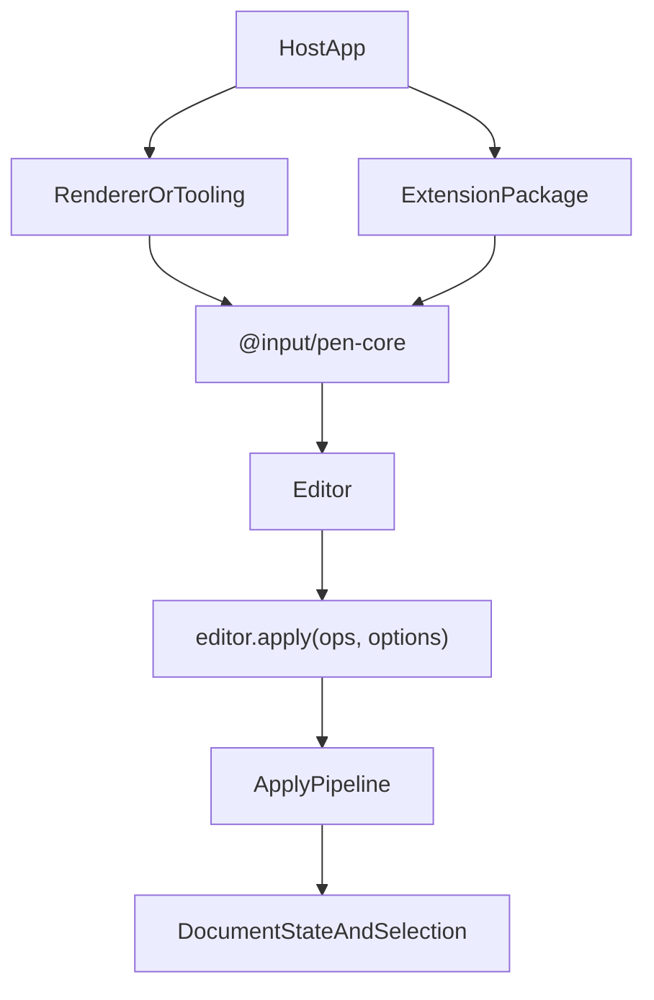

# @input/pen-core

## Purpose

`@input/pen-core` is the headless runtime authority for Pen. It owns editor creation, document state, selection, extension dispatch, normalization, decorations, and the canonical mutation path.

## Public Role

Every higher-level package depends on the contracts and runtime behavior established here. Renderer packages mount the editor, extension packages add behavior, and import/export packages prepare or consume document state, but `@input/pen-core` remains the place where document truth is created and mutated.

## Key Exports / Entrypoints

- Export map: `.`
- Runtime entrypoints such as `createEditor()`, `createHeadlessEditor()`, and `createDocumentSession()`
- Schema runtime exports such as `defineBlock()`, `defineExtension()`, `prop()`, `SchemaRegistryImpl`, `mergeSchemas`, and `SchemaEngineImpl`. `defineBlock()` returns `DefinedBlockSchema`, which is assignable to `BlockSchema` (API10): `a11y` is typed as both the resolved spec and the AX4 fluent attach `(spec) => BlockSchema`. The runtime value is one or the other — the attach function until `.a11y()` runs (spec reads are `undefined` there), or the frozen spec when `config.a11y` was given (calling it there throws, a hazard that predates the dual type). The intersection buys `BlockSchema[]` assignability without a runtime change and is priced as exactly this seam.
- Read-model and editor helpers such as `SelectionAuthority`, `DocumentRangeImpl`, and `ExtensionManagerImpl`. `DocumentStateImpl` is the live `DocumentState` implementation but stays off the barrel; hosts read `editor.documentState`.
- Decoration and inline-completion helpers such as `createDecorationSet()`, `mergeDecorationSets()`, `ensureInlineCompletionController()`, and `getInlineCompletionController()`
- Import and profile-policy helpers such as `blocksToOps()`, `normalizePendingBlocksForImport()`, `filterOpsForDocumentProfile()`, and related policy-reporting APIs. Core owns the implementation and the public export.
- Slash-menu display ordering (`orderSlashMenuItemsByGroup()`, `slashMenuGroupOf()`), which partitions `allBlockDisplays()` by `display.group` so a menu's rendered order equals the index order it navigates and confirms. It lives here, beside the `allBlockDisplays()` registry it reorders, because it is DOM-free and every renderer's slash menu needs the same invariant (API6).
- Suggestion-menu target matching (`resolveSuggestionMenuTarget()`, `inlineLogicalText()`): caret-offset lookbehind in the logical domain (N6). React's `useSuggestionMenu` re-exports the resolver.
- Block-capability helpers (`getFlowCapabilityFromSchema()`, `shouldExposeBlockInTooling()`, and siblings) and selection-target helpers (`resolveSelectionTargetBlockIds()`, `renderSelectionTargetText()`, `renderSelectionTargetBlockText()`)
- `mapOffsetThroughSplices()` — the per-block clamp helper for one summary, moved here from `@input/pen-types` by v4 DL12 so types can reach its types-only end state. There is still no compose and no cross-commit mapping form; anchors carry positions across commits.
- Catalog helpers (`interpolateMessage()`, `resolveMessage()`), mutation-group helpers (`createMutationGroupMetadata()`, `getApplyOptionsGroupId()`, `getOpOriginGroupId()`, `getOpOriginType()`), field-editor helpers (`usesInlineTextSelection()`, `supportsInlineMarks()`, and siblings), and tool-execution helper `collectToolExecutionOutput()`
- Locale-aware case folding (`foldAndNormalize()`) next to `localeFacet`; search, AI alignment, and suggestions call this instead of `toLowerCase()`
- Core facets including `keymapFacet` (`pen.keymap`), `inputRulesFacet`, `beforeApplyFacet`, `decorationsFacet`, `commandsFacet`, `ariaReadOnlyFacet`, `clipboardFacet` (R8: merged paste-importer table), `urlPolicyFacet`, `localeFacet` (`pen.locale`), `messagesFacet` (`pen.messages`), `a11yLabelFacet` (`pen.a11yLabel`), `aiEgressFacet` (`pen.aiEgress`), and single-value controller facets such as `searchControllerFacet` and `smoothStreamControllerFacet`
- `streamThroughEgress()` / `aiEgressExtension()` — generation, suggestions, and autocomplete share this single egress seam
- The SEC1 URL admission policy (`urlPolicy`, `UrlContext`, `UrlPolicy`) next to `urlPolicyFacet`; `@input/pen-dom` re-exports it for renderer hosts, and the exporters read it from here so no extension depends on a renderer
- Workspace scripts: `build`, `clean`, `dev`, `test`, `typecheck`

## Dependencies And Boundaries

- Runtime dependencies: `@input/pen-yjs`, `@input/pen-types`
- Peer dependencies: No peer dependencies declared.
- Boundary: `@input/pen-core` is the runtime center of gravity for Pen and should remain headless. It does not depend on shortcuts, undo, `@input/pen-ai/stream`, tools, content-ops, or markdown-serialization. Those packages depend on core.

## Runtime Model

The core runtime sits between package contracts and the packages that bind or extend the editor:

Important rules:

- `DocumentOp[]` is the mutation currency. The union is closed at ten variants: `splice-text`, `format-text`, `insert-block`, `delete-block`, `move-block`, `set-props`, `set-meta`, `grid`, `app`, `stream-open`.
- Durable document writes go through `editor.apply(...)`.
- Structured operation origins can carry `groupId`, `requestId`, `actorId`, `source`, and `intent` so hosts can attribute and group mutations without inventing a parallel apply path. Dispatch stamps `origin.intent` with the command name; a pre-set intent is preserved only when no command is on the dispatch stack. The apply pipeline passes that structured object into `adapter.transact` without copying it; the Yjs adapter matches it with a `TrackedOriginSet` (see `@input/pen-yjs`).
- Split and merge are command recipes, not ops. `pen.splitBlock` is one apply of `insert-block` plus two `splice-text` ops, stamped `intent: "pen.splitBlock"`. Merge is `pen.deleteBackward` / `pen.deleteForward` at a block boundary. The summary carries `block-split` / `blocks-merged` from an in-transaction structural tag, not from the intent string.
- `editor.anchors` is the selection-anchor API: mint, resolve, serialize, deserialize. Resolution returns a live target or `null`. Split/merge content moves are repaired in core (`deriveContentMoves` / `repairAnchor`) before resolve. A position that must survive commits is an anchor; summaries do not map raw points across commits.
- `editor.lastChangeSummary` is the latest commit's summary, or `null` before the first observable apply. Commit numbering starts at 1. There is no summary ring buffer and no `summaryLog.between`.
- Empty text-capable `Y.Text` is `""`. `BlockHandle.textContent()` / `textDeltas()` on that block are empty. Load migrates lone stored `"\u200B"` via `strip-empty-block-sentinels`, under the string origin `"migration"` (`MIGRATION_ORIGIN`), emitting `diagnostic { code: "empty-block-sentinels-stripped" }`. The migration runs only when the format stamp is below 3; there is no remote-commit heal. Embedded `\u200B` in longer text is kept.
- Feature composition is opt-in. Bare `createEditor()` installs the apply pipeline only: no schema (empty registry, `firstBlock()` is `null`), no rich-text shortcuts, no undo, no stream extension, no tools. The no-preset fallback list is empty. `createEmptySchema()` still _resolves_ unknown types as passthrough (`onUnknownBlock: "passthrough"`), so `schema.resolve("paragraph")` is not `null` — it is just not a registered type. `defaultPreset()` is the batteries-included path.
- Without `undoExtension()`, `editor.undoManager` is an inert stub: `canUndo()` / `canRedo()` return `false`, `undo()` / `redo()` return `false`, and the `undo:manager` slot is absent. There is no error. Undo looks present and does nothing. Install `undoExtension()` or `defaultPreset()`.
- `pen.ariaReadOnly` (`ariaReadOnlyFacet`) some-combines booleans. It does **not** decline typing, does **not** stop `editor.apply`, and does **not** stop the wire. Renderers read it only to set `aria-readonly`. The `readonly` prop on `EditorRoot` / `PenEditor` / `mountEditor` is what declines local typing. That split is shipped and is an open owner decision; this spec records it, it does not resolve it.
- `editor.blocks()` / `editor.blockCount()` walk nested and layout children, matching `documentState.blocks` / `documentState.blockCount`. `documentState.blockOrder` is the top-level sequence only. Text-range insert, replace, delete, mark toggle, and `DocumentRange.blockRange` walk that nested order including closed-container descendants (D6). Document-edge caret (`pen.caretDocStart`, `pen.caretDocEnd`) walks the *visible* nested order — open-container children only — not `blockOrder` and not closed-container descendants.
- Extensions can prepare work, observe `commit` events (`CommitEvent`), and write `internals.assignSlot` (which overrides the mapped core facet). They do not bypass the core mutation boundary.
- Renderer packages read `DocumentState`, `BlockHandle`, selection, and decorations from the editor; they do not become alternate document authorities.
- `extension.facets` is the only _contribution_ channel: shortcuts are `keymapFacet` providers, input rules `inputRulesFacet`, decorations `decorationsFacet` (all in `core/src/facets/coreFacets.ts`). It is not the only member of `Extension` — `activateClient`, `activateServer`, `observe`, and `state` are lifecycle and observation hooks, and the extension manager calls all of them. `defineExtension({ setup })` is accepted by the type and called by nothing.
- The command registry and catalog are settled: dispatch keeps the D/K/B rules. Selection _bridging_ inside `@input/pen-dom` remains unsettled; do not treat that bridging as a finished contract from this spec.

## Headless Workflows

`createHeadlessEditor()` is the preferred factory for server-side or workflow-only editor use. It keeps Pen headless and applies the same document pipeline to existing CRDT documents without mounting a renderer. Hosts should use it for AI workers, export workers, migrations, and contract tests that need editor semantics without UI behavior.

Headless editors default to the core apply pipeline only, same as bare `createEditor()`: empty schema unless one is passed, empty extension list. To get undo, shortcuts, or the stream extension in a non-rendered workflow, pass `preset: defaultPreset(...)` or register those extensions explicitly. `createHeadlessEditor({ useDefaultExtensions: true })` currently does not install any of those packages — it only skips the empty headless preset object. That option is vestigial; the JSDoc on the flag still claims it enables undo/shortcuts/delta-stream. Prefer an explicit preset.

`CreateEditorOptions.assets` is vestigial in the same way: `@input/pen-types` declares it and `createEditor` never reads it, so a host that passes it gets no `assetProviderFacet` binding and image paste and drop stay declined. The wiring that works is either an extension contributing `assetProviderFacet.of(provider)` or the renderer's `assets` prop, which writes the `paste:assetProvider` slot. This is the API10 fourth state — the type promises and the runtime shrugs — and resolving it means either reading the option or removing it, both changes to a published surface.

## Integration Notes

- Path in workspace: `packages/core`
- Spec path mirrors workspace path: `packages/core.md`
- Typical adoption starts with `@input/pen`'s `createEditor()`, which defaults an omitted `preset` to `defaultPreset()`. Core's bare `createEditor()` is the composition point for hosts that assemble everything themselves, and the wrong default for a rich-text host.
- React and Vue `useEditor()` inject `defaultSchema` and still install no preset. Same empty extension list as bare `createEditor()`.
- On core's constructors, use `createEditor({ preset: defaultPreset(...) })` or explicit `extensions` for feature composition.
- Server/workflow adoption starts with `createHeadlessEditor()` plus a wrapped CRDT document, then a preset or extensions when the workflow needs more than apply; `@input/pen`'s `createHeadlessEditor()` carries the batteries default for workflows that want the standard stack.
- Schema composition happens here through the registry/merge APIs, not in renderer packages. `ComposableSchema.override(type, patch)` spreads the patch onto the existing block schema (serialize bags merge). When `patch` includes `propSchema` and does not include `validateProps`, the merged schema's `validateProps` is regenerated from the merged `propSchema` with the same generator `defineBlock` uses; an empty merged `propSchema` sets `validateProps` to `undefined`. An explicit `patch.validateProps` is kept unchanged, including a host-built delegating validator. SCH1 (schema reservation; not the DOM scheduler SCH1 in `rules/dom.md`): an inline atom (`InlineSchema.kind === "node"`) may not declare a prop named `type`. Y.Text embed records store the atom discriminator on `type` and flatten the remaining keys beside it (`embedRecordFromAtom` / `toInlineDeltaInsert`); a host prop of that name cannot be stored without changing the layout. `SchemaRegistryImpl` throws at construction. Marks are unaffected. Hosts that need a type-like field rename it (for example `contextType`).

- Serialization packages and tool packages should treat the editor as the authority boundary, even when they export convenience helpers

## Current Maturity / Intended Usage

Workspace package at version `0.1.9`; intended usage is current-state but still evolving. In practice, this is still the package that defines the architecture for the rest of the repo, so churn here has repo-wide impact.

## Non-goals

- Do not make `@input/pen-core` renderer-specific.
- Do not turn it into an application shell, transport layer, or auth surface.
- Do not let convenience helpers replace the editor as the source of mutation truth.
