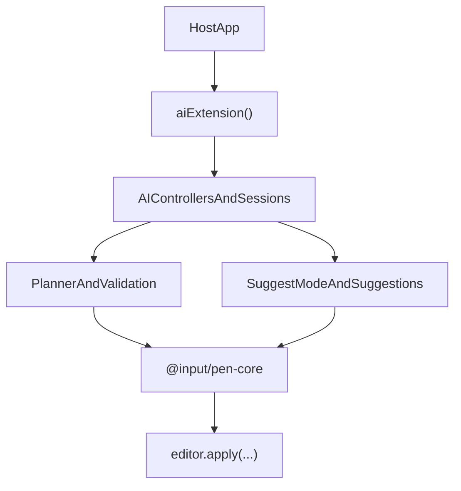

# @input/pen-ai

## Purpose

`@input/pen-ai` adds AI-oriented editor behavior to Pen: controller state, session orchestration, suggest mode, track-changes flows, review artifacts, contextual prompting, planner and execution helpers, mutation receipts, plus the suggestions, autocomplete, skills, tools, and stream surfaces on subpaths.

## Public Role

This package extends the editor with AI behavior without taking over document authority. It is responsible for orchestrating AI flows around the editor, not for replacing the editor mutation pipeline or becoming a renderer package.

In current usage, `@input/pen-ai` is the headless orchestration layer for both inline edits and chat-driven edits. It owns session lifecycle, target resolution, prompt sequencing, reviewable suggestion staging, and the translation from model output into bounded editor mutations. The five feature subpaths live in the same package so they share one egress seam and one dependency footprint.

## Key Exports / Entrypoints

- Export map: `.`, `./suggestions`, `./autocomplete`, `./skills`, `./tools`, `./stream`, `./package.json`
- Root: `aiExtension()`, controller accessors such as `getAIController()`, `getAIInlineCompletionController()`, `getAIInlineHistoryController()`, and `getAIReviewController()`. Accessors read core facets (`aiControllerFacet` and siblings). Activate still `assignSlot`s keys such as `AI_CONTROLLER_SLOT` and `INLINE_COMPLETION_SLOT` (defined on `@input/pen-types`).
- Command surfaces such as `AICommandRegistry` and `defaultAICommands`
- Planner, contract, validation, and execution helpers for structured mutation flows
- Suggestion helpers such as `acceptSuggestion()`, `rejectSuggestion()`, the batch forms `acceptSuggestions(editor, ids, { origin?, undoGroupId? })` / `rejectSuggestions(...)` that resolve many ids as one undo group under a caller-chosen origin, `readAllSuggestions()`, and suggest-mode interceptors. Runtime review items are `PersistentSuggestion` / `PersistentBlockSuggestion`. The contract-layer `BlockSuggestion` on `@input/pen-types` is re-exported here with `export type` (API4) and shares that action union, including `split-block` and `format-text` (RS7).
- Review styling re-exports on the main entry: `REVIEW_SURFACE_CLASSES`, `REVIEW_SURFACE_BLOCK_SUGGESTION_CLASSES`, and `REVIEW_SURFACE_CUSTOM_PROPERTIES` from `@input/pen-types`. The default sheet is `PEN_REVIEW_STYLESHEET` on `@input/pen-dom` (RS4); this package cannot re-export it without depending on a renderer (API1).
- Rich AI types covering sessions, prompts, execution modes, previews, plans, receipts, and stream events
- Session surfaces for `inline-edit` and `bottom-chat`, including prompt history, turn tracking, and contextual prompt state
- Shared AI mutation contracts for selection-backed rewrites, scoped-range rewrites, block rewrites, and document transforms
- Edit-channel configuration on `aiExtension()`: durable edits always go through `edit_document` (`tool-edit`); `editStreaming` (`AIEditStreaming`) and `mutationPreference` with runtime `setMutationPreference()`
- Egress re-exports: `aiEgressFacet`, `aiEgressExtension()`, `streamThroughEgress()` from `@input/pen-core`
- Workspace scripts: `build`, `clean`, `dev`, `lint`, `test`, `typecheck`

## Dependencies And Boundaries

- Runtime dependencies: `@input/pen-ingest`, `@input/pen-core`, `@input/pen-tools`, `@input/pen-types`
- Peer dependencies: No peer dependencies declared.
- Boundary: The extension composes through the core editor and slots/events rather than side channels. Network egress is owned by core `pen.aiEgress`, not by a second filter chain in this package.

## Runtime Model

`@input/pen-ai` wraps model-facing workflows around the editor rather than bypassing it:

Important rules:

- Model output still has to land through the editor runtime.
- All model streams go through core `streamThroughEgress()` / `pen.aiEgress`. This package re-exports that helper; it does not keep a second filter chain.
- Suggest mode and review flows are mutation-management features, not alternate document stores.
- Suggest-mode interception matches on the ten `DocumentOp` primitives plus `origin.intent`. A split arrives as one apply with `intent: "pen.splitBlock"`; suggest-mode renders it as a split from the intent, not from a compound op type.
- Renderer packages consume AI controller state, but renderer packages do not own the AI runtime contract.
- Follow-up AI edits should reuse session context instead of treating each prompt as isolated.
- Inline edits and chat rewrites should converge on the same bounded mutation machinery whenever possible so streaming previews, diffs, and undo stay consistent.

## AI Mutation Contract

The current AI runtime resolves most rewrite behavior into explicit editor targets before streaming begins.

Durable document edits always go through `edit_document`. Streaming generation lanes (selection rewrite, cursor continuation) still write text deltas. Prompt routing, mutation posture, op budgets, undo grouping, and the apply path are shared.

- Chat and document-scope prompts route to `tool-loop` / `tool-edit`. The model is offered `edit_document` and assistant text is never applied as a mutation.
- Selection-rewrite and cursor-continuation keep their text streaming strategies (`text-fast-apply`, `markdown-full-replace`).

`@input/pen-playground` exposes `?mutation=direct|suggestions` and `?editStreaming=preview|atomic`.

- Inline edits operate on live or pinned selections and stage reviewable suggestions against that selection.
- Chat rewrites that target a title, paragraph, or whole document are resolved into synthetic but explicit range targets rather than open-ended document narration.
- The preferred rewrite path is `rewrite-selection` with a target kind of either `selection` or `scoped-range`.
- `scoped-range` is used for synthetic scopes such as `heading`, `paragraph`, `block`, or `document` where the runtime still wants selection-like provenance and diff behavior.
- A live selection that covers whole paragraphs — one or several — resolves to a `scoped-range` of scope `block` in markdown. A `selection` target commits as a text splice into its first block, which would fold every paragraph the model returns into that block; the block scope requests, previews, and commits the reply as a block-range replacement instead. A selection ending at offset 0 of a block stops at that paragraph boundary and leaves the block out of the scope. Partial selections stay `selection` targets because they have text around them to keep, and so does any selection reaching a block that is not a paragraph: the scope commits by parsing the reply as markdown, and that parse would return a heading or list item rewritten to prose as a paragraph.
- A single-block streaming rewrite holds its write head as one `assoc: 1` `editor.anchors` mint at the selection end, repaired on content-move commits and resolved before each delta splices (ST2), with an `assoc: -1` mint at the selection start for the range the first delta marks deleted. The delete gets that one delta: once text sits at the head, deleting from the start again would swallow the arriving text too.
- An inline turn re-anchors on what the reply landed as: a `selection` target on the text it spliced, a `scoped-range` target on the blocks it staged. The turn re-anchors when it enters review; accepting re-anchors its session and contextual prompt with it. A block-range replacement deletes its own target blocks, so an anchor left there dies with them and leaves the session pointing at a block that is gone — a host positioning its prompt UI from that anchor drops it wherever its own fallback points.
- A remote edit does not cancel a run. Cancellation on an external commit is for the local user taking the block back, and every update arriving through `applyUpdate` normalizes to `origin: "collaborator"` (COL1), so peers are excluded along with `ai`, `system`, and `extension`.
- Conflict detection uses target provenance such as selection signatures, block revisions, synced generation, and source-text checks before final apply. Alignment compares folded text via core `foldAndNormalize()`, not `toLowerCase()`.
- Multi-block markdown rewrites stream as staged suggestions by default so users can review, accept, reject, and undo them. Hosts without a review UI can set `mutationPreference: "direct"` on `aiExtension()` to land AI edits immediately; suggest mode and the review lane always stage regardless.
- Structural prompts (convert to list, tables, restructuring) route through the tool loop with every other durable mutation. Document-scope prompts on small documents build their working set as annotated markdown — each block prefixed with a `<!-- block:<id> <type> -->` comment — so the model can address any block precisely.
- Documents larger than `AI_ANNOTATED_WORKING_SET_MAX_BLOCKS` still take the tool loop; the bound only gates whether the working set annotates the whole document.

## Edit Channel

A durable AI edit is an `edit_document` tool call. Prompt routing, mutation posture, op budgets, undo grouping, and the apply path are shared with the rest of the AI runtime. Selection-rewrite and cursor-continuation lanes keep writing text deltas; they are generation, not an edit plan.

`@input/pen-playground` exposes `?mutation=direct|suggestions` and `?editStreaming=preview|atomic`.

### The `edit_document` tool

`toolsExtension()` registers `edit_document` as a mutating, destructive tool. Its envelope is `{ operations: [...] }` over a closed set of seven operations: `replace_block_text`, `replace_blocks`, `insert_blocks`, `delete_blocks`, `move_block`, `format_text`, and `set_block_props`. Content arrives as plain `text` or as `markdown` compiled through `buildDocumentWriteOps()`; structured operations carry `marks`, `blockType`, or `props` instead.

Operations compile to `DocumentOp[]` through `planEditDocument()`, pass batch validation, and land through `executeEditDocument()`. The plan keeps envelope ownership on each compiled op (`compiled` / `compiledOperations`); planning does not apply. The default write is `editor.apply(..., { origin: "ai" })`. `executeEditDocument` observes the apply boundary and merges a structured applied/rejected outcome into `EditDocumentResult`, so a hook that drops an op is not reported as applied (EC5). A host that needs a different origin, undo group, or persistence wrapper injects `apply` / `origin` on `executeEditDocument()` or `editDocumentTool()`; that `apply` must still call `editor.apply` (EC13, EC21) and must not remap results. `toolsExtension()` registers `editDocumentTool(editor)` with the default apply path. The handler does not throw for semantic failures — it returns an `EditDocumentResult` in which good operations applied and rejected ones come back with a live outline of `{ blockId, blockType, preview }` so the model can re-target without re-reading the document.

### Staleness

The runtime hashes the annotated markdown it actually rendered for the model, per tracked block, and keeps those hashes on the working set envelope. Staleness is therefore a property of the view the model was shown, not of a document revision counter, which is what lets an unrelated edit elsewhere in the document leave a pending call valid.

### Rules

- EC1. On the tool channel a durable edit is an `edit_document` call and nothing else. Assistant text on that channel is reply-only: `textCanCommitMutation()` is false for `tool-edit`, so buffered prose is never committed.
- EC2. Operations address blocks by id. Ranges within a block are allowed; document-wide locators such as offsets or line numbers are not in the schema.
- EC3. The envelope is structured; the content inside it is markdown compiled by the shared `buildDocumentWriteOps()` path rather than a second parser.
- EC4. The operation set is closed and minimal. Adding an operation is a schema change, not a prompt change.
- EC5. A refusal is informative. Semantic failures return a result naming what was rejected and why, with a live outline; schema violations throw and reach the model as a journal entry. Operations in one call apply independently, so a partial batch is a partial apply plus a refusal, never a silent drop.
- EC6. The tool channel has no fallback that writes unparsed or unvalidated content. If the call does not compile, nothing lands.
- EC7. Staleness is detected by comparing a fingerprint of the rendered view against the block's current view, not by a revision counter.
- EC8. Fingerprints are runtime-only. They are never placed in the prompt and the model never sees or echoes them.
- EC9. A stale target produces a refusal and a refreshed working set inside the same turn. It does not cancel the generation.
- EC10. The edit channel runs inside the agentic loop, so a refusal is retried in the same turn rather than surfacing as a failed generation.
- EC11. Direct and suggestions postures are one parameter. The schema, the prompt, and the compiled operation plan are identical; only the final write differs — `editor.apply` versus the suggest-mode interceptor.
- EC12. The XML channel is retired. `edit_document` is the only durable edit path; `editChannel` is not an `aiExtension()` option.
- EC13. Tool-channel ops go through `editor.apply` like every other mutation. Op budgets, the write guard, and undo grouping are unchanged by the channel.
- EC14. A mutating tool pass that completes cleanly ends the turn without spending an extra closing model pass.
- EC15. Partial `edit_document` input streams into an in-document preview decoration, scanned per operation index rather than by first match. The durable apply still happens when the call closes.
- EC16. Tool advertising is route-scoped: on the edit channel with block annotations present, non-mutating tools are filtered down to a discovery set.
- EC17. The edit tool is forced only on a pass that has edit intent and block annotations, and only when the adapter supports forced tool choice. `question` intent is exempt, so asking about a document does not provoke an edit.
- EC18. `format_text` and `set_block_props` stage marks and props as structured operations. Marks are enumerated from the live schema, and an HTML payload in a text or markdown field is refused rather than escaped.
- EC19. `mutationPreference` is live through `setMutationPreference()`. A turn already in flight keeps the posture it started with.
- EC20. With `editStreaming: "commit"`, `insert_blocks` blocks whose structure has settled are written as they arrive; replace and delete are excluded because early writes would stale their own fingerprints. Streamed ops charge against the turn op budget, and a refusal rolls them back — by deleting the inserted blocks, or by rejecting their suggestions under the suggestions posture.
- EC21. The public compile-and-apply path is `planEditDocument` / `executeEditDocument` / `editDocumentTool` on `@input/pen-tools`. `planEditDocument` reports `compiledOperations`, not applied ones. `executeEditDocument` observes the apply boundary and merges dropped ops into `EditDocumentResult` so a filtered write is not listed as applied (EC5). `toolsExtension()` registers the default `origin: "ai"` apply. A host that needs a custom origin or a wrapper around `editor.apply` injects `ExecuteEditDocumentOptions`; it does not reimplement the operation compiler, markdown insertion, target checks, or result mapping. The injected `apply` still lands through `editor.apply` (EC13). Pinned by `packages/extensions/tools/src/__tests__/executeEditDocument.host.test.ts`.

## Session Behavior

Sessions are first-class runtime state, not renderer-local convenience state.

- Both `inline-edit` and `bottom-chat` sessions track turns, generation ids, prompt history, pending suggestions, and active turn state.
- Follow-up prompts should include recent session prompt history in the model-facing prompt so iterative edits remain sequence-aware.
- Inline edit sessions keep their target anchored even if the live selection changes after the prompt UI opened.
- Accepting or rejecting a session turn should cleanly resolve the staged suggestions associated with that turn.
- Undo should treat an accepted AI turn as one logical reversible action.

## Suggestions (`@input/pen-ai/suggestions`)

Proactive Grammarly-style writing suggestions. Headless: detects eligible local edits, asks a host-provided analyzer for bounded candidates, stages those suggestions against live document ranges, and exposes controller state for renderer UIs.

- `aiSuggestionsExtension()`, `getAISuggestionsController()` — reads `aiSuggestionsControllerFacet`; activate `assignSlot`s `AI_SUGGESTIONS_CONTROLLER_SLOT`
- Analyzer helpers on the barrel: `AI_SUGGESTIONS_REQUEST_MODE`, `AI_SUGGESTIONS_SYSTEM_PROMPT`, `buildAISuggestionMessages()`, `parseSuggestionResponse()`
- Analyzer requests stream through core `streamThroughEgress()` / `pen.aiEgress`
- Matching, cache fingerprints, and analyzer no-op checks fold text with core `foldAndNormalize()` and `localeFacet`
- Each materialized suggestion holds one `editor.anchors` range, minted at creation and repaired on content-move commits. Death is `resolve` returning `null` or `collapsed: true` after repair.
- Suggestions remain advisory until explicitly applied. Scope building stays bounded; this is not a document-wide unrestricted rewrite surface.
- `@input/pen-react` exposes UI through `Pen.AISuggestions.Root`, `Pen.AISuggestions.Popover`, and related hooks.

Lifecycle: user-originated commits mark blocks dirty; the scheduler waits for debounce, stability, minimum changed characters, and per-block cooldown; scope building extracts a sentence-level or bounded local scope; the host analyzer returns structured candidates; candidates are filtered by confidence, dismissal memory, cache reuse, and overlap; materialized suggestions become inline decorations plus grouped popover state; apply and dismiss go through the controller.

## Autocomplete (`@input/pen-ai/autocomplete`)

Low-latency inline ghost-text completion. The subpath owns request scheduling and controller state; it does not own the model filter chain.

- `autocompleteExtension()`, `getAutocompleteController()`, `createAutocompleteProvider()`, `builtinAutocompleteProviders()`, `AUTOCOMPLETE_SYSTEM_PROMPT`
- Completion requests stream through core `streamThroughEgress()` / `pen.aiEgress`
- The continuation target is one `editor.anchors` mint at request time, repaired on content-move commits, and resolved when the completion arrives

## Skills (`@input/pen-ai/skills`)

Agent skill artifacts for Pen AI tools.

- `listDefaultAISkills()`, `renderSkillFiles()`
- Types: `AISkillDefinition`, `AISkillFile`, `AISkillScript`

## Tools (`@input/pen-ai/tools`)

Canonical AI tool surface. Transports authorize a model-driven call before execution.

- `openAIToolCall()`, `executeAITool()`, `getAIToolRuntime()`, `listAITools()`, `authorizeAIToolCall()`, `createAIToolTurn()`
- `openAIToolCall()` authorizes a call and installs the write guard before the transport runs `executeAITool`. Transports must not call `executeAITool` unless the result is `{ ok: true }`.
- Op budgets are atomic: a batch that exceeds the per-call or per-turn op budget is rejected whole and reaches the model as an error, never applied as a silent prefix. A per-call overflow fails only that call; exhausting the turn total ends the turn. The `AIToolBudgetError` class itself is deliberately not re-exported — it has one in-package caller and never reaches a host.
- The agentic loop's `maxSteps` bounds model passes (round trips), not journal entries; tool results are compacted with explicit truncation markers that tell the model what was cut and how to re-read.
- `close()` on that opened call restores the patched `editor.apply` and is idempotent: the first result is stored, and later calls return that same result. The write guard is restored in `finally`, not `catch`. A non-throw unwind (abandoning a stream mid-`yield`) runs `finally` and skips `catch`; a `catch`-only restore left the guard patched onto the host editor and silently dropped every later `editor.apply` editor-wide.
- The live `Editor` used for the guard is `ToolContext.editor` at construction. That is a local runtime field, not `PenStreamRequest.context.editor` (removed from the wire type).

## Stream (`@input/pen-ai/stream`)

Streaming protocol and processing pipeline. Optional runtime that turns a `PenStream` of parts into editor mutations. It is not installed by core's `createEditor()`. `defaultPreset()` is the path that includes it, which `@input/pen`'s constructors apply by default.

- `deltaStreamExtension()`, `processStream()`, `smoothStreamExtension()`, `getSmoothStreamController()`
- Install via `defaultPreset()` or `createEditor({ extensions: [deltaStreamExtension()] })`. Smooth streaming is opt-in: `smoothStreamExtension()` or `defaultPreset({ smoothStream: true })`.
- Core `openTextStream` holds one `assoc: 1` local anchor as the write head; each flush repairs then resolves before splicing.
- A run publishes `streaming: { blockId }` on awareness off its first `source: "stream"` commit (ST6) and clears it when the run ends. The write is skipped while the block id is unchanged: the payload is fixed for the zone's life, and republishing it per flush would spend the peer's whole `MAX_PRESENCE_UPDATES_PER_SECOND` budget. The zone id stays local — receivers key the presence by client and block, and `@input/pen-multiplayer` is what renders it.
- `smoothStreamExtension()` withholds paint of paced appends (`source: "stream"` by default — ST6's streaming-write contract) behind `omitFromRender` decorations. The document is already complete; a library-owned ticker advances a per-block frontier (ST7–ST9). `getSmoothStreamController()` reads `smoothStreamControllerFacet`.

## Integration Notes

- Path in workspace: `packages/extensions/ai`
- Spec path mirrors workspace path: `packages/extensions/ai.md`
- Typical integration installs `aiExtension()` on the editor and then uses renderer-specific primitives or hooks to expose AI UI
- `@input/pen-react` provides the broadest AI UI surface today, but the extension itself stays headless
- `@input/pen-tools` is a key dependency because AI flows need document-tool and mutation preparation helpers
- Hosts should treat the controller as the source of truth for AI session state, review items, and pending suggestion lifecycle
- Renderer UIs may expose separate inline and chat surfaces, but both surfaces should flow through the same session and mutation contracts exposed here
- Playground integration exercises the analyzer request path and the renderer lifecycle for underline, popover, apply, and dismiss

## Current Maturity / Intended Usage

Workspace package at version `0.2.3`; intended usage is current-state but still evolving. This is one of the most ambitious packages in the workspace and should be treated as a large extension surface rather than a minimal helper package.

## Non-goals

- Do not duplicate core editor authority.
- Do not make the extension itself responsible for renderer UI ownership.
- Do not collapse transport, auth, or host-specific model policy into the package by default.
- Do not let chat-only or renderer-only mutation semantics drift away from the shared selection-backed execution model.
- Do not assume a specific model provider, backend transport, or host-side prompt policy.
- Do not allow unbounded whole-document rewrites to masquerade as proactive inline suggestions.
