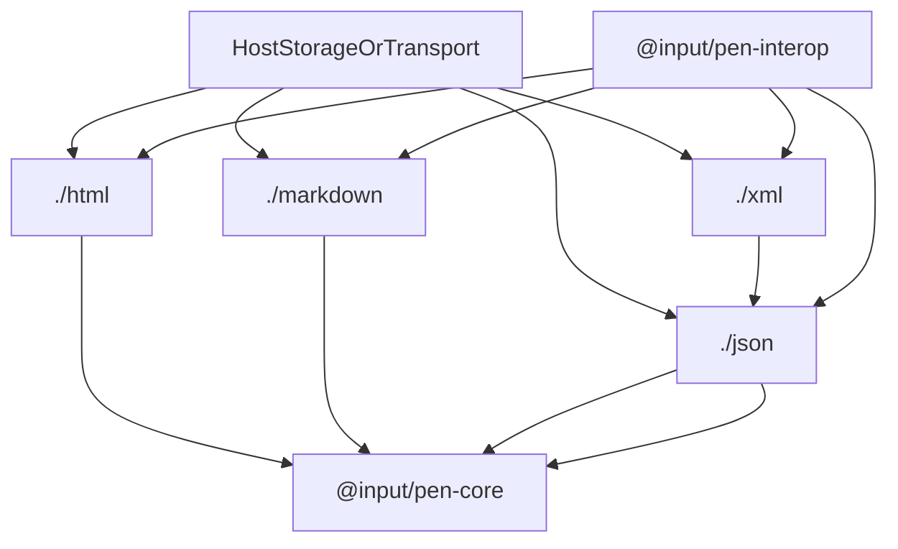
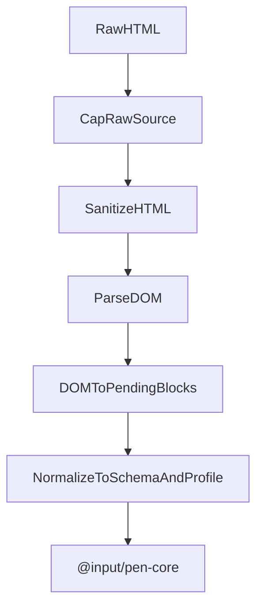
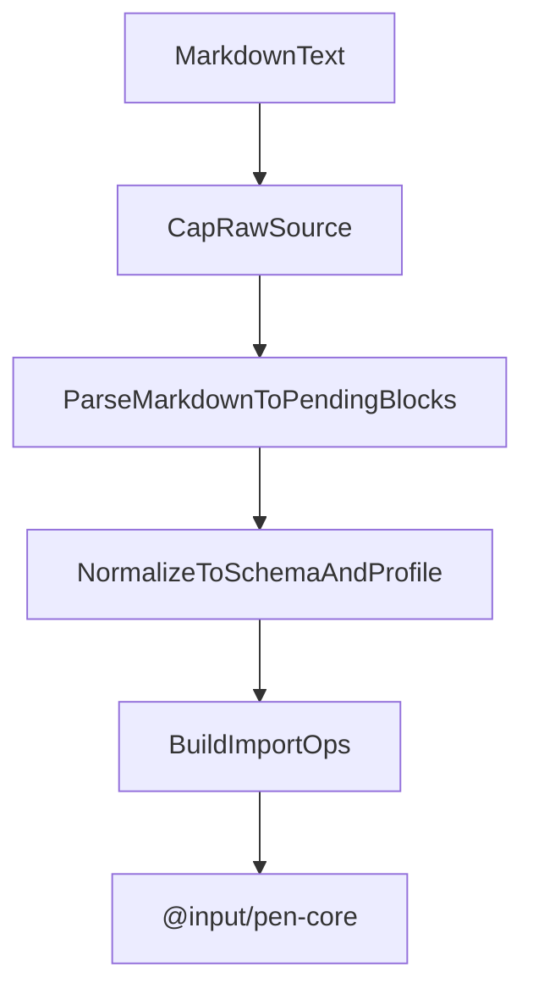
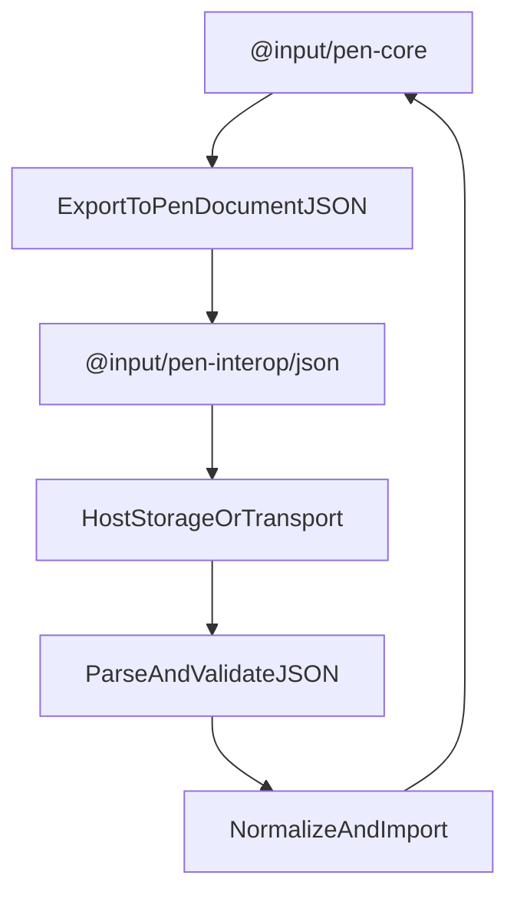
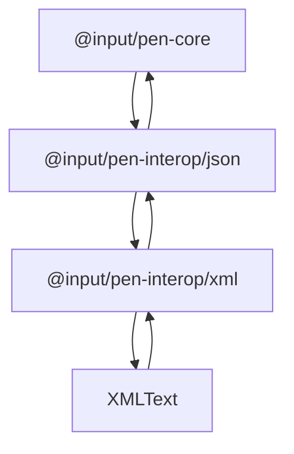

# @input/pen-interop

## Purpose

`@input/pen-interop` is Pen's interchange package: HTML, Markdown, JSON, and XML import and export, each on its own subpath.

## Public Role

This package sits just outside the editor runtime. It turns untrusted external markup or structured documents into pending blocks and operations, and it serializes editor state into host-owned artifacts. It does not become a second editor, a renderer, or a competing document model.

`@input/pen-markdown` stays a separate shared package. Document-ops and the Markdown exporter consume it; it is not folded in here.

## Key Exports / Entrypoints

- Export map: `.`, `./html`, `./markdown`, `./json`, `./xml`, `./package.json`
- Root re-exports the format barrels. Prefer the format subpath when a host only needs one format.
- Workspace scripts: `build`, `clean`, `dev`, `test`, `typecheck`

## Dependencies And Boundaries

- Runtime dependencies: `@input/pen-ingest`, `@input/pen-core`, `@input/pen-markdown`, `@input/pen-types`, `domhandler`, `htmlparser2`, `isomorphic-dompurify`
- Peer dependencies: No peer dependencies declared.
- Boundary: This package owns safe ingest and serialization. Durable writes still go through `editor.apply(...)`. JSON is the canonical machine-readable envelope; XML is a syntax layered on that envelope.

## Runtime Model

Important rules:

- Treat every ingest source as untrusted.
- Cap or refuse the raw string before parse so work is O(cap), not O(input).
- Normalize pending blocks against the active schema and document profile before they become operations.
- Export walks `editor.documentState.allBlocks()`, including nested, layout, table, and list children. It does not serialize only top-level `blockOrder`.
- Ingest-envelope numbers (depth, node count, text size, image count) live as copies on each format. They are not a shared module.
- Empty text-capable blocks export as `""`. A lone stored `"\u200B"` is not an empty-block encoding. A `"\u200B"` inside longer user text is preserved.

## HTML (`@input/pen-interop/html`)

HTML is the main external-rich-content ingest boundary and the HTML export wrapper.

- Import: `htmlImporter`, `parseHtmlToBlocks()`, `parseHtmlWithReport()`, `sanitizeHTML()`, `admitProviderImageUrl()`, ingest-envelope constants
- Export: `htmlExporter`

HTML import is staged so untrusted input is capped and sanitized before it becomes importable content:

- `capRawHtmlSource()` slices the raw string to `INGEST_MAX_TEXT_SIZE` (preferring a newline boundary) before sanitize/parse. Overflow is a `text-size-exceeded` drop, not a hard refuse. `parseHtmlSource()` throws if a caller bypasses the cap and hands it a longer string.
- `admitProviderImageUrl()` decides on the parsed URL protocol (`new URL(...)`), not a regex over the raw string. Local provider schemes (`blob:`, `memory:`) pass; everything else goes through `urlPolicy`.
- Sanitize after the cap, then parse, then normalize. Imported content only becomes document state after conversion into operations and `editor.apply(...)`. The SEC3 style hook admits `color`, `background-color`, and enumerated `text-align` keywords (`left` / `right` / `center` / `justify` / `start` / `end`), plus a validated HTML `align` attribute (`left` / `right` / `center` / `justify`). Mapping those onto block props stays a host `fromHTML` concern.

- HTML export walks the full block tree. It is a fragment exporter, not a delivery-document builder. A registered block schema's `serialize.toHTML` is the markup for that block, including `image`: the built-in `serializeImageHTML` runs only when the schema has no `toHTML`. Schema image HTML still has every `` admitted through SEC1 `urlPolicy` (refused URLs become `data-pen-blocked-url=""` with no `src`, and the raw URL is not re-emitted). List export still builds `<ul>`/`<ol>` runs, but the schema's outer `<li …>` attributes are kept when the item is re-wrapped.

## Markdown (`@input/pen-interop/markdown`)

Markdown is the plain-text authoring ingest layer and the exporter wrapper around `@input/pen-markdown`.

- Import: `markdownImporter`, `parseMarkdownToBlocks()`, `parseMarkdownWithReport()`, ingest-envelope constants including `INGEST_TIME_BUDGET_MS`
- Export: `markdownExporter`, plus `exportMarkdownForBlocks()` / `exportMarkdownRange()` from the serialization package

- Cap-before-parse: `parseCappedMarkdownToBlocks(input)` is `parseMarkdownSource(capRawMarkdownSource(input))`. Overflow is a `text-size-exceeded` drop, not a hard refuse. JSON ingest is different: it refuses rather than slices, because a sliced JSON string is invalid.
- `INGEST_TIME_BUDGET_MS` (1000) is advisory. It is not a unit-suite gate and is not enforced as a wall-clock abort. The enforceable bound is the pre-parse source cap.
- Markdown parsing produces pending blocks, not final document truth. The current editor schema and document profile still decide what survives.
- Export serialization lives in `@input/pen-markdown`. This subpath is the exporter wrapper (URL admission, `markdownExporter`).

## JSON (`@input/pen-interop/json`)

JSON is the canonical structured interchange shape: document versioning, block trees, inline content, marks, and optional metadata.

The subpath ships two importers:

- `jsonImporter` / `parseJsonToBlocks()` / `parseJsonWithReport()` — dedicated ingest (schema validation, ingest envelope, proto-key rejection)
- `jsonDocumentImporter` / `parseJsonDocument()` — the export-side round-trip importer used by tests and XML handoff

Hosts that want ingest bounds and proto-key rejection should use `jsonImporter`, not `jsonDocumentImporter`.

- Export: `jsonExporter`, `exportEditorToJson()`, `textExporter`, `exportEditorToText()`, `exportPlainText()`, `exportPenDocumentToText()`, `PEN_DOCUMENT_JSON_VERSION`, `isSupportedPenDocumentVersion()`, public JSON model types

- `capRawJsonSource()` runs on the raw string before `JSON.parse`. A source over `INGEST_MAX_TEXT_SIZE` is refused (`null`), not sliced.
- Unknown block types and unknown props are dropped. Own keys `__proto__`, `constructor`, and `prototype` are rejected anywhere in the payload. Validation builds fresh null-prototype records; it does not deep-merge parsed JSON.
- URLs are not pre-laundered on JSON ingest.
- Text export traverses the same JSON block tree and supports host-provided block filtering and inline node rendering.
- `exportEditorToText()`, `exportPlainText()`, and `exportPenDocumentToText()` provide deterministic plain-text extraction for headless workflows, search indexes, previews, tests, and host-owned delivery pipelines.

## XML (`@input/pen-interop/xml`)

XML is a secondary interchange syntax on top of the JSON envelope. It does not invent a second document model.

- Export: `xmlExporter`, `serializePenDocumentToXml()`, `PenXmlDocument`, `XmlExporterExtraOptions`
- Import: `xmlImporter`, `parseXmlDocument()`

- XML export first derives the canonical Pen JSON document shape, then serializes that shape into XML.
- XML import caps the raw string before parse. A source longer than `INGEST_MAX_TEXT_SIZE` is refused (`capRawXmlSource()` returns `null`); it is not sliced. `xmlImporter.import` emits `import-truncated` and inserts nothing; `parseXmlDocument` throws. After parse, the same node / depth / image envelope as JSON ingest truncates the tree. `INGEST_TIME_BUDGET_MS` is advisory.
- XML import parses into the Pen JSON envelope, then delegates apply to `jsonDocumentImporter` from `./json`, not the ingest `jsonImporter`.
- `htmlparser2` and `domhandler` are parse implementation details, not a signal to grow into a general HTML/XML engine.

## Integration Notes

- Path in workspace: `packages/extensions/interop`
- Spec path mirrors workspace path: `packages/extensions/interop.md`
- `@input/pen` takes the default HTML paste importer from `./html` (`htmlClipboardExtension` contributes `htmlImporter` through `clipboardFacet`, R8). `@input/pen-vue` still defaults `paste:importers.html` to `htmlImporter` when the host does not pass one. `@input/pen-react` does not install a default HTML importer. Markdown ingest stays an optional React peer on `@input/pen-interop`.
- `@input/pen-test` uses JSON export from `./json` for headless export contracts.
- Prefer `./json` as the conceptual starting point when reasoning about data shape; XML stays aligned with that shape.
- `parse*ToBlocks()` / `parse*WithReport()` are useful when a host wants pending blocks without immediately applying them. `*Importer.import()` is the live-editor path.

## Current Maturity / Intended Usage

Workspace package at version `0.1.8`; intended usage is current-state but still evolving. HTML ingest is security-sensitive. JSON already defines Pen's explicit structured document contract.

## Non-goals

- Do not duplicate core editor authority.
- Do not trust source HTML, Markdown, JSON, or XML as already safe or schema-valid.
- Do not grow into a general-purpose browser rendering or DOM manipulation package.
- Do not treat the export-side JSON importer as the ingest envelope.
- Do not create a separate XML-specific mutation pipeline.
- Do not make host delivery policy, CSS inlining, or provider quirks part of this package.
- Do not fold `@input/pen-markdown` into this package.
