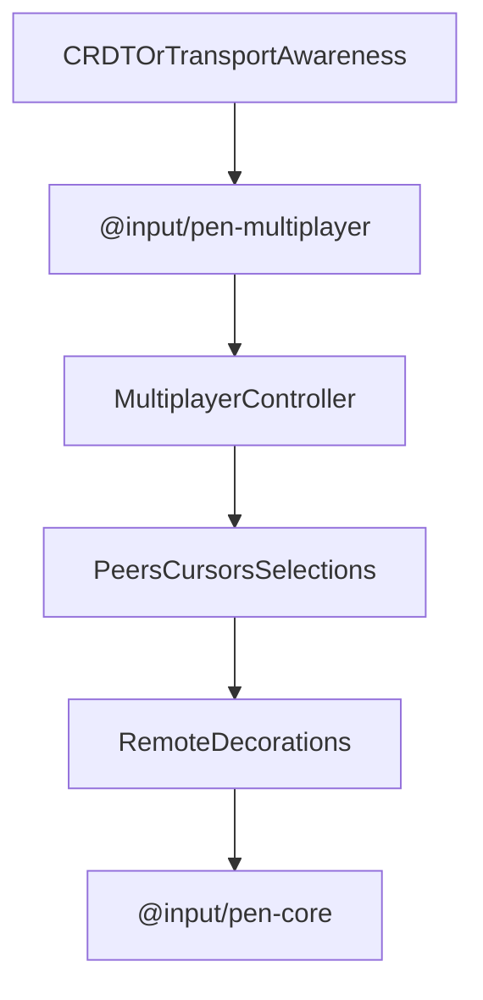

# @input/pen-multiplayer

## Purpose

`@input/pen-multiplayer` provides multiplayer presence and sync primitives for Pen. It manages connection state, peer identity resolution, remote cursor and selection state, author ledgers, and renderer-facing remote decorations.

## Public Role

This package adds collaboration awareness around the editor without turning itself into the document authority. Its main role is to project remote user state into Pen's headless runtime and UI surfaces while leaving actual document mutation truth to the core and CRDT layers underneath.

## Key Exports / Entrypoints

- Export map: `.`
- Primary extension entrypoint: `multiplayerExtension()`
- Controller lookup: `getMultiplayerController()` reads `editor.facet(multiplayerControllerFacet)`. Activate still `assignSlot`s `MULTIPLAYER_CONTROLLER_SLOT` (defined on `@input/pen-types`), which overrides that facet.
- `MultiplayerControllerImpl` is the runtime controller; it is reached through `multiplayerExtension()` / `getMultiplayerController()`, not the barrel
- Presence helpers such as `assignMultiplayerColor()` and `normalizeMultiplayerColor()`
- Public multiplayer state and snapshot types covering users, peers, cursors, selections, remote AI streaming, and session context
- `MultiplayerController.getRemoteStreaming()` and `RemoteStreamingState` for the peers whose AI is generating
- Workspace scripts: `build`, `clean`, `dev`, `test`, `typecheck`

## Dependencies And Boundaries

- Runtime dependencies: `@input/pen-core`, `@input/pen-types`
- Peer dependencies: No peer dependencies declared.
- Boundary: This package owns collaboration awareness and renderer-facing remote state, but it does not replace core mutation authority or the underlying CRDT transport.

## Runtime Model

`@input/pen-multiplayer` turns awareness state into Pen controller state and remote decorations:

Important rules:

- Remote presence is collaboration state, not document truth.
- Remote cursor and selection visuals are derived from controller state and emitted as decorations.
- Peers put serialized `editor.anchors` payloads on the awareness wire. Receivers `deserialize` them as `provenance: "wire"` and resolve per flush. A `null` resolve hides the caret until the next awareness frame or catch-up.
- Cell selections are the exception to both of those. They travel as `{ row, col }` coordinates rather than anchors, matching AS3's structural treatment of the local cell selection, and they carry no cursor because a grid cell is the smallest region the presence names. They emit no decorations either — there is no cell-scoped decoration type and a table block has no block-level text — so renderers paint them from controller state, and the grid is re-read on every commit to clamp held endpoints in.
- A peer's in-flight AI run arrives as `streaming: { blockId }` and leaves as a `pen-multiplayer-streaming` block decoration. The block id is the whole payload because the generated text never enters the document, so naming the block is all there is to show. `resolveRemoteStreaming` re-checks the block on every commit and drops the peer when it goes, the same treatment held cell selections get.
- Local presence writes merge into the awareness state rather than replacing it. This runtime owns `user`, `cursor`, and `selection`; a wholesale write would unpublish `streaming` and anything a host carries alongside it.
- Local presence is coalesced to a 50ms minimum interval (`LOCAL_PRESENCE_MIN_INTERVAL_MS`, internal), not published per selection change. Receivers cap ingest at `MAX_PRESENCE_UPDATES_PER_SECOND` (30, exported). The two numbers are a pair: a sender that outruns the receive cap is rate-limited by its peers, and a rate-limited peer keeps the sender's previous caret — so the caret freezes and then jumps rather than trailing smoothly. Coalescing below the receive budget is what keeps that from happening.
- Identity resolution and author ledgers should enrich collaboration state without coupling the package to one transport provider.

## Integration Notes

- Path in workspace: `packages/extensions/multiplayer`
- Spec path mirrors workspace path: `packages/extensions/multiplayer.md`
- Install `multiplayerExtension()` when a host app wants collaboration presence, remote cursors, or remote selection rendering
- Renderers consume controller state and decorations; they should not reimplement peer-tracking logic locally
- The package is designed to sit above transport or CRDT awareness feeds rather than own networking itself

## Current Maturity / Intended Usage

Workspace package at version `0.2.0`; intended usage is current-state but still evolving. It is already an important architectural layer because it defines how collaboration presence becomes editor-visible state without collapsing transport and rendering into one package.

## Non-goals

- Do not duplicate core editor authority.
- Do not make the package itself responsible for networking or transport session orchestration.
- Do not let remote presence state become a substitute for the canonical document model.
