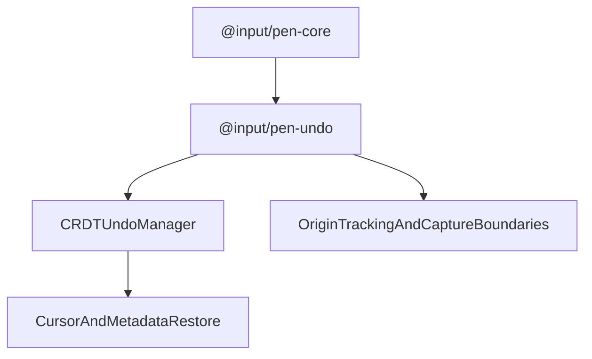

# @input/pen-undo

## Purpose

`@input/pen-undo` provides undo/redo behavior for Pen on top of the CRDT adapter. It manages tracked origins, capture boundaries, explicit undo groups, cursor restoration metadata, and renderer-facing history restore coordination.

## Public Role

This package is the reversible-editing layer for live editing sessions. It does not replace `editor.apply(...)`, but it governs which applied operations are grouped, which origins are tracked, and how undo/redo restores editor selection and related metadata.

## Key Exports / Entrypoints

- Export map: `.`
- Primary extension entrypoint: `undoExtension()`
- Public options surface: `UndoExtensionOptions`
- Runtime manager: `UndoManagerImpl` — **internal since 2026-08-23, no longer on the barrel.** It is still the runtime manager; it is reached through `undoExtension()` rather than imported. Removed in the pre-publish surface shrink after a repo-wide grep found its only importers were `undo/src/**` and its own tests.
- Workspace scripts: `build`, `clean`, `dev`, `test`, `typecheck`

## Dependencies And Boundaries

- Runtime dependencies: `@input/pen-core`, `@input/pen-types`
- Peer dependencies: No peer dependencies declared.
- Boundary: This package owns undo/redo orchestration around the CRDT undo manager, but it does not become the editor mutation authority.

## Runtime Model

`@input/pen-undo` wraps the underlying CRDT undo stack and adds Pen-specific grouping and restore semantics:

Important rules:

- Undo and redo operate on previously applied operations; they do not bypass the core mutation path.
- Origins matter: the package decides which operation origins are tracked and how explicit undo groups change capture behavior. The Yjs adapter, not this package, owns `TrackedOriginSet` — the apply pipeline tags transactions with a structured origin object, and `Y.UndoManager` would otherwise miss those transactions because it matches `trackedOrigins` by identity.
- This package is not installed by bare `createEditor()`. Without it, `editor.undoManager` is an inert stub (`canUndo()` is `false`, `undo()` returns `false`) and the `undo:manager` slot is absent. Where a keymap binds undo at all, Mod-Z reaches that stub and does nothing; a bare `createEditor({ schema })` has no keymap bindings, so nothing is bound in the first place. Either way no diagnostic is emitted. Install this extension or `defaultPreset()`.
- This package depends on `@input/pen-core` for anchor repair (`deriveContentMoves`, `repairAnchor`) and `fieldEditorHostFacet`. It also keeps a local `getOpOriginType` in `src/origin.ts` even though core exports one; that copy is a leftover, and this package's own tests import core's.
- Cursor and metadata restoration are part of the package contract so history operations restore editor state, not just document bytes. Stack-item selection snapshots stay the primary restore path. When commits land after capture, the extension resolves local-provenance drift anchors minted at capture (`editor.anchors`) instead of mapping through a summary window.

## Integration Notes

- Path in workspace: `packages/extensions/undo`
- Spec path mirrors workspace path: `packages/extensions/undo.md`
- Install `undoExtension()` when a host wants live reversible editing semantics with Pen's origin-aware grouping
- Treat `trackedOrigins` and group boundaries as part of the editing architecture, not just UX polish
- This package complements `@input/pen-snapshots`: undo is short-horizon reversible editing, while history is durable snapshot/version management

## Current Maturity / Intended Usage

Workspace package at version `0.1.9`; intended usage is current-state but still evolving. Even so, it is already a subtle package because grouping and restore behavior shape how editing feels across typing, paste, AI operations, and collaboration-aware origins.

## Non-goals

- Do not duplicate core document authority.
- Do not treat undo stacks as durable version history.
- Do not push renderer-specific keyboard handling or UI composition into the undo package.
