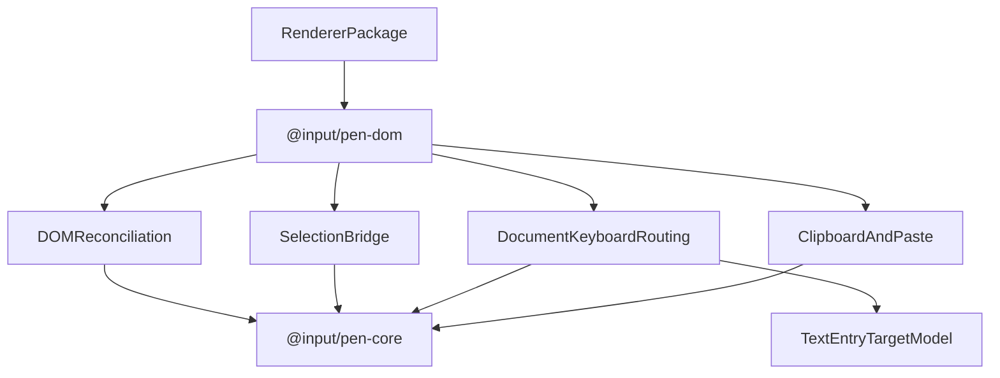

# @input/pen-dom

## Purpose

`@input/pen-dom` provides the shared DOM field-editor engine, document-keyboard routing, and low-level DOM reconciliation helpers used by Pen renderers. It is the package that turns editor state into browser editing behavior without tying that behavior to React or Vue.

## Public Role

This package sits between `@input/pen-core` and renderer packages. It owns DOM-specific editing concerns like reconciliation, selection bridging, clipboard handling, text-entry target detection, document shortcuts, table-cell navigation, and select-all behavior, while leaving component structure and framework lifecycle to the renderer layer.

## Key Exports / Entrypoints

- Export map: `.`, `./field-editor`, `./field-editor/beforeinputMap`, `./field-editor/clipboard`, `./field-editor/commands`, `./field-editor/contenteditableBackend`, `./field-editor/crdt`, `./field-editor/dropResolver`, `./field-editor/editContextBackend`, `./field-editor/expandedContentEditableBackend`, `./field-editor/fieldEditorImpl`, `./field-editor/inlineAtomDom`, `./field-editor/inlineAtomInteraction`, `./field-editor/inlineAtomModel`, `./field-editor/keyHandling`, `./field-editor/reconciler`, `./field-editor/selectionBridge`, `./field-editor/store`, `./field-editor/transfer`, `./field-editor/transferImages`, `./constants/selectAll`, `./utils/aiDomScope`, `./utils/aiKeyboardScope`, `./utils/autocompleteController`, `./utils/blockDrag`, `./utils/blockSelectionSemantics`, `./utils/cellSelection`, `./utils/clipboardPayload`, `./utils/dataAttributes`, `./utils/editorEmptyState`, `./utils/editorInteractionModel`, `./utils/environment`, `./utils/fieldEditor`, `./utils/fieldEditorTextEntryAttrs`, `./utils/flowCapabilities`, `./utils/inlineAtomDragPreview`, `./utils/inlineAtomSelection`, `./utils/inlineDecorations`, `./utils/inlineInputRule`, `./utils/listInputRule`, `./utils/menuPosition`, `./utils/parentIdTree`, `./utils/placeholderVisibility`, `./utils/pointerSelection`, `./utils/remoteCellSelection`, `./utils/replaceElementChildren`, `./utils/selectionFormation`, `./utils/selectionPlacement`, `./utils/slashMenuPopupAria`, `./utils/suggestionMenuPopupAria`, `./utils/tableDefaults`
- Root exports such as `mountEditor()`, `handleFieldEditorPointerActivate()`, `FieldEditorImpl`, `FieldEditorSession`, `handleEditorDocumentKeyDown()`, `handleEscapeSelectionTransition()`, `handleTableCellSelectionKeyDown()`, `resolveSelectAllBehavior()`, text-entry routing helpers, and `PasteImporters`. `PasteImporters` is root-only; there is no `./types/paste` subpath.
- Also on the root: the geometry reader (`createGeometryReader()`, `measureWithRoot()`, `verticalCaretTarget()`, `collapsedRect()`, `getRootGeometry()`), `DomScheduler`, the URL policy surface (`urlPolicy`, `resolveEditorUrl()`, `urlPolicyFromEditor()`, `urlPolicyExtension()`), region selection (`RegionSelectionStore`, `attachContentGestures()`), inline-atom interaction helpers (`attachInlineAtomWrapperInteractions()`, `canDestructure()`, `destructureInlineAtom()`, `removeInlineAtom()`, `getInlineAtomAtOffset()`), `createReducedMotionSignal()`, and editor chrome (`PEN_EDITOR_CHROME_STYLESHEET`, `adoptEditorChrome()`, `EDITOR_CHROME_CUSTOM_PROPERTIES`). `removeInlineAtom` deletes one atom at a logical offset and returns false when that offset is stale; React renderers reach it through `InlineAtomRenderInteractionProps.remove`. Double-click destructure still goes through `destructureInlineAtom`.
- Field-editor exports such as `fullReconcileToDOM()`, `applyDeltaToDOM()`, selection bridge helpers, cross-block selection helpers, clipboard handlers, and field-editor store types. `fullReconcileDeltasToDOM()` is on `./field-editor/reconciler` only, not on the `./field-editor` barrel. Clipboard copy slices `inlineDeltas()` so embed inserts survive the JSON flavor (IOP7), and interchange flavors call the atom serialize hooks (IOP8).
- DOM utility subpaths for renderer packages that need shared data-attribute or decoration helpers
- Workspace scripts: `build`, `clean`, `dev`, `test`, `typecheck`

## Dependencies And Boundaries

- Runtime dependencies: `@input/pen-core`, `@input/pen-shortcuts`, `@input/pen-types`
- Peer dependencies: No peer dependencies declared.
- Boundary: `@input/pen-dom` sits between the core runtime and framework bindings and should remain framework-agnostic.

## Runtime Model

`@input/pen-dom` is the browser editing engine that both reads from and writes back to the headless editor:

Important rules:

- DOM selection is a view-layer representation and must stay synchronized with editor selection.
- Renderer roots should install `bindEditorDocumentKeyDown()` (or the same phase split) so `shouldHandleEditorKeyboardEvent()` gates `handleEditorDocumentKeyDown()`. Escape (HOST7) and block-selection Enter (HOST8) are bubbling defaults so a later-mounted overlay or host element listener can `preventDefault` first. Other document shortcuts stay in capture. While a block or cell selection is active, DOM focus stays on the focus sink when the editor owns focus or focus has fallen to the body (HOST9). Native inputs and other editor roots keep their own keyboard ownership.
- Clipboard and typing flows resolve back into editor mutations instead of mutating the document model directly.
- Shared Escape, select-all, block-selection, history shortcut, deletion, and table-cell navigation behavior belongs here when it is DOM-engine behavior, not framework-specific UI behavior.
- Table cell copy, cut, paste, printable-key entry, and navigation must preserve structured cell selection metadata and apply document changes through `editor.apply(...)`.
- Pointer activation is resolved on the **block** element (`data-pen-editor-block`), not the inline-content span. Without chrome an empty document's inline span is zero-width; listening only there never receives the first click. `handleFieldEditorPointerActivate()` walks from the event target to the block, then attaches the field editor to the inline surface if one exists.
- Pointer and shift-click range formation orders blocks by the nested document walk (`documentState.blocks`), not top-level `blockOrder`, so a drag across children-array children (D6, RI6) still has a forward/back direction.
- Projecting a text endpoint onto a block uses that block's own `[data-pen-inline-content]` — the inline whose nearest `[data-pen-editor-block]` is this block. A descendant query would steal a nested child's inline from a container that has none of its own (an opened `emailQuote`) and map the container's `0..1` unit extent (N2) into that child's text. Blocks with no own inline map around the element, same as a divider.
- Element-local selection preservation across a reconcile (`saveSelection` / `restoreSelection`) only applies when both DOM endpoints lie inside the element being rebuilt; otherwise it declines rather than collapsing a cross-block range into that element. When a decoration change rebuilds the blocks of an expanded (multi-block) surface, the selection is projected back from the editor after the rebuild, the same as after a commit. Every post-rebuild write of the selection — the expanded surface's projection, and the single-field backends' `handleDecorationsChange` caret restore — first asks the field editor's `shouldProjectSelectionAfterReconcile()`; while a native text-entry control that is not this field owns focus the field is rebuilt without it (HOST9), because a DOM selection written into the field would pull focus back.
- Authority-driven projections — P1 (`selectionChange` same-turn and the scheduler retry), P2 (divergence), and the parked mount-ack retry — are likewise withheld while a native text-entry control that is not this field owns focus, and the backend selection write is held back with the P1 one. Gesture and programmatic projections are not gated (HOST9).
- Host-chrome clicks (root, blocks host, or content wrapper) above the first inline-text block activate that block at offset `0`. Clicks below the last inline-text block activate that block at its end. Clicks that land in the gap _between_ two blocks stay inactive. Vue and vanilla share `resolveHostChromeFallbackBlock()`. React uses a different below/above path — see `@input/pen-react`.
- `mountEditor(editor, root)` is the public vanilla document-shell composition: it constructs `FieldEditorImpl`, calls `createDocumentTree`, sets the root, and wires focus, pointer activation, and document keydown. Installing `FieldEditorImpl` and calling `setRootElement` alone does not build the document tree and renders a blank page. `setRootElement` never calls `createDocumentTree`. By default it also adopts `PEN_EDITOR_CHROME_STYLESHEET` (`adoptEditorChrome()`); pass `{ chrome: false }` for the unstyled HOST6 path.
- `mountEditor({ readonly: true })` declines pointer activation and sets `data-readonly`. `pen.ariaReadOnly` is read only for `aria-readonly`. The facet does not decline typing. That split is an open owner decision.
- All three colour marks write `data-color` and paint through a `var()` fallback so a host can remap an opaque token without `!important` (RI7): `textColor` and `backgroundColor` as `` with `var(--pen-text-color, <value>)` / `var(--pen-background-color, <value>)`, and `highlight` as `<mark data-color>` with `var(--pen-highlight-color, <value>)` and no `data-mark-type`. A missing or empty `color` prop paints nothing. Unknown marks are `` only.
- `applyElementAttributes()` lowercases attribute keys before deciding. `href`, `src`, and `xlink:href` go through `urlPolicy` (`xlink:href` as a link URL). Event-handler names and `style` are dropped. The helper still defaults to the package `urlPolicy` if the caller omits a policy; hosts must pass the editor so a configured `pen.urlPolicy` is not skipped.
- `fullReconcileToDOM` / `fullReconcileDeltasToDOM` require either `{ editor }` or `{ urlPolicy }`. Passing `editor` reads `urlPolicyFromEditor(editor)`. Idle React and Vue inline and table-cell surfaces pass `{ editor }`. Image `src` on the React `ImageRenderer` and Vue `PenBlock` image fallback goes through `resolveEditorUrl(editor, src, "image")`.
- Boolean `data-*` attributes are emitted in the valueless HTML form (`data-readonly=""`) and omitted when off. `buildDataAttributes()` is the helper: `true` becomes `""`, `false`/`undefined` are dropped. Hosts should write `[data-readonly]`, not `[data-readonly="true"]`. ARIA booleans stay the literal strings `"true"` / `"false"` (`aria-hidden="true"`); a valueless ARIA boolean is invalid.
- An empty text-capable field renders exactly one ` ` child. Reconciliation writes and removes it. `extractTextFromDOM` ignores `data-pen-empty` nodes, so field `textContent` and extracted text are `""`. The caret overlay `data-offset` on an empty field is `0`. The placeholder is never serialized.
- A text-capable field whose logical text ends with `\n` renders exactly one ` ` as its last child, because `white-space: pre-wrap` gives a trailing newline no line box of its own (RI5). Both reconcile paths maintain it. It contributes no logical length and no logical text, so `extractTextFromDOM` and offset mapping read through it, and it is never serialized.
- Selection bridging and geometry are under redesign. Do not treat the current selection-bridge or bidi-geometry details in this package as a settled contract.

## Integration Notes

- Path in workspace: `packages/rendering/dom`
- Spec path mirrors workspace path: `packages/rendering/dom.md`
- Vanilla hosts should call `mountEditor()`. Framework renderers assemble the same pieces themselves.
- Renderer packages should depend on this package instead of each reimplementing selection bridging or reconciliation
- The `./field-editor` subpath is the main surface for renderer authors who need lower-level control
- React and Vue roots both install `FieldEditorImpl`, `assignSlot` the field editor and paste assets, and delegate document-level keyboard handling back to this package. Vue also uses `handleFieldEditorPointerActivate()` on the editor root. Default HTML paste is not owned here: `defaultPreset()` installs `html-clipboard`; Vue still defaults `htmlImporter` when the host omits importers.
- This package should stay small in conceptual scope even if its internals are complex, because it is a boundary package rather than a product surface

## Current Maturity / Intended Usage

Workspace package at version `0.2.1`; intended usage is current-state but still evolving. It is now a key architectural package because it proves the shared editing engine can outlive any single framework renderer.

## Non-goals

- Do not put React- or Vue-specific component abstractions here.
- Do not let DOM convenience code become a second source of document truth.
- Do not collapse host-app keyboard UX, app chrome, or renderer composition into the field-editor engine.
