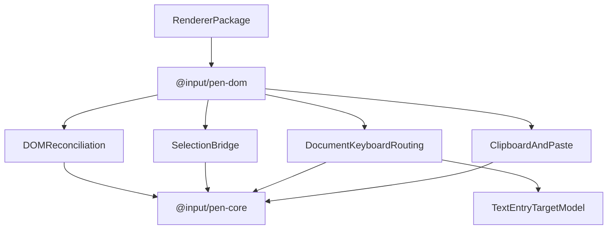

# @input/pen-dom

## Purpose

`@input/pen-dom` provides the shared DOM field-editor engine, document-keyboard routing, and low-level DOM reconciliation helpers used by Pen renderers. It is the package that turns editor state into browser editing behavior without tying that behavior to React or Vue.

## Public Role

This package sits between `@input/pen-core` and renderer packages. It owns DOM-specific editing concerns like reconciliation, selection bridging, clipboard handling, text-entry target detection, document shortcuts, table-cell navigation, and select-all behavior, while leaving component structure and framework lifecycle to the renderer layer.

## Key Exports / Entrypoints

- Export map: `.`, `./field-editor`, `./field-editor/beforeinputMap`, `./field-editor/clipboard`, `./field-editor/commands`, `./field-editor/contenteditableBackend`, `./field-editor/crdt`, `./field-editor/dropResolver`, `./field-editor/editContextBackend`, `./field-editor/expandedContentEditableBackend`, `./field-editor/fieldEditorImpl`, `./field-editor/inlineAtomDom`, `./field-editor/inlineAtomInteraction`, `./field-editor/inlineAtomModel`, `./field-editor/keyHandling`, `./field-editor/reconciler`, `./field-editor/selectionBridge`, `./field-editor/store`, `./field-editor/transfer`, `./field-editor/transferImages`, `./constants/selectAll`, `./utils/aiDomScope`, `./utils/aiKeyboardScope`, `./utils/autocompleteController`, `./utils/blockDrag`, `./utils/blockSelectionSemantics`, `./utils/cellSelection`, `./utils/clipboardPayload`, `./utils/dataAttributes`, `./utils/domNodes`, `./utils/editorEmptyState`, `./utils/editorInteractionModel`, `./utils/environment`, `./utils/fieldEditor`, `./utils/fieldEditorTextEntryAttrs`, `./utils/flowCapabilities`, `./utils/inlineAtomDragPreview`, `./utils/inlineAtomSelection`, `./utils/inlineDecorations`, `./utils/inlineInputRule`, `./utils/listInputRule`, `./utils/menuPosition`, `./utils/parentIdTree`, `./utils/placeholderVisibility`, `./utils/pointerSelection`, `./utils/remoteCellSelection`, `./utils/replaceElementChildren`, `./utils/selectionFormation`, `./utils/selectionPlacement`, `./utils/slashMenuPopupAria`, `./utils/suggestionMenuPopupAria`, `./utils/tableDefaults`
- Root exports such as `mountEditor()`, `handleFieldEditorPointerActivate()`, `FieldEditorImpl`, `FieldEditorSession`, `handleEditorDocumentKeyDown()`, `handleEscapeSelectionTransition()`, `handleTableCellSelectionKeyDown()`, `resolveSelectAllBehavior()`, text-entry routing helpers, and `PasteImporters`. `PasteImporters` is root-only; there is no `./types/paste` subpath.
- Also on the root: the geometry reader (`createGeometryReader()`, `measureWithRoot()`, `verticalCaretTarget()`, `collapsedRect()`, `getRootGeometry()`), `DomScheduler`, the root overlay (`getRootOverlay()`, `overlayItemStyle()`, `overlayLabelStyle()`, the remote-caret contributor `attachRemoteCarets()`, `getRemoteCaretSource()`, `remoteCaretKey()`, `REMOTE_CARET_CONTRIBUTOR` with the types `RemoteCaretSource`, `RemoteCaretCursor`, `RemoteCaretUser`, `AttachRemoteCaretsOptions`, and the types `RootOverlay`, `OverlayContributor`, `OverlayRequest`, `OverlayPaintPlan`, `OverlayPaintItem`, `OverlayItemKind`, `OverlayCaretRole`, `OverlayPaintMode`, `OverlayReadContext`, `OverlayFieldState`), the URL policy surface (`urlPolicy`, `resolveEditorUrl()`, `urlPolicyFromEditor()`, `urlPolicyExtension()`), region selection (`RegionSelectionStore`, `attachContentGestures()`), inline-atom interaction helpers (`attachInlineAtomWrapperInteractions()`, `canDestructure()`, `destructureInlineAtom()`, `removeInlineAtom()`, `getInlineAtomAtOffset()`), `createReducedMotionSignal()`, `getRootReducedMotion()` (the one per-root AX6 signal, reflected as `data-pen-reduced-motion` on the root), `AX6_MOTION_MAPPING`, `REDUCED_MOTION_ATTR`, and editor chrome (`PEN_EDITOR_CHROME_STYLESHEET`, `adoptEditorChrome()`, `EDITOR_CHROME_CUSTOM_PROPERTIES`). `removeInlineAtom` deletes one atom at a logical offset and returns false when that offset is stale; React renderers reach it through `InlineAtomRenderInteractionProps.remove`. Double-click destructure still goes through `destructureInlineAtom`.
- `resolveBlockTextAlignment()` validates the shared `textAlignment` block prop before vanilla, React, or Vue renderers apply it to a block host.
- Field-editor exports such as `fullReconcileToDOM()`, `applyDeltaToDOM()`, selection bridge helpers, cross-block selection helpers, clipboard handlers, and field-editor store types. `fullReconcileDeltasToDOM()` is on `./field-editor/reconciler` only, not on the `./field-editor` barrel. Clipboard copy slices `inlineDeltas()` so embed inserts survive the JSON flavor (IOP7), and interchange flavors call the atom serialize hooks (IOP8).
- DOM utility subpaths for renderer packages that need shared data-attribute or decoration helpers
- Workspace scripts: `build`, `clean`, `dev`, `test`, `typecheck`

## Dependencies And Boundaries

- Runtime dependencies: `@input/pen-core`, `@input/pen-shortcuts`, `@input/pen-types`
- Peer dependencies: No peer dependencies declared.
- Boundary: `@input/pen-dom` sits between the core runtime and framework bindings and should remain framework-agnostic.

## Runtime Model

`@input/pen-dom` is the browser editing engine that both reads from and writes back to the headless editor:

```mermaid
flowchart TD
  Renderer[RendererPackage]
  Dom["@input/pen-dom"]
  Reconcile[DOMReconciliation]
  Selection[SelectionBridge]
  Keyboard[DocumentKeyboardRouting]
  TextEntry[TextEntryTargetModel]
  Clipboard[ClipboardAndPaste]
  Core["@input/pen-core"]

  Renderer --> Dom
  Dom --> Reconcile
  Dom --> Selection
  Dom --> Keyboard
  Keyboard --> TextEntry
  Dom --> Clipboard
  Reconcile --> Core
  Selection --> Core
  Keyboard --> Core
  Clipboard --> Core
```

Important rules:

- Per-block state reaches renderers through the field editor's block notifier (`fieldEditor.blockNotifier`, types on `./field-editor/store`): one subscription each to `commit`, `selectionChange`, `decorationsChange`, the field-editor store, and the inline completion controller, fanned out by block id to per-block snapshots whose slices keep their identity while unchanged. `notifyDomReconciled(blockId)` bumps that block's DOM-sync version only; the store's global `domSyncVersion` remains for host code. Bindings subscribe per block to the notifier, never to the editor (SCALE6).
- `mountEditor`'s document tree updates only the blocks the notifier names, writes an attribute only when it differs, reconciles inline content only when the block's revision moved or the field editor released it, and moves only reordered nodes. It no longer re-syncs the whole tree on every commit and field-editor change.
- AX1 list semantics come from the notifier: each list item's `list` slice carries `level`, `posinset`, `setsize`, and `groupKey` beside its `ordinal`, which counts over the same sibling list (AX1), and `subscribeListSegments(parentId)` / `getListSegments(parentId)` (`null` for the root) partition a sibling list into list groups and other blocks with core's `getListSegments` / `getListItemSemantics`. A structural commit walks only the list runs around its changes and notifies the items whose slice moved, including items outside `affectedBlockIds`; a commit with no structural change, or any non-commit event, touches no list state, ordinals included, so a keystroke or caret move in a long numbered run reads no run (SCALE6). The sibling lists a change touches include the container a `parentId`-route child rendered in when it is removed, merged away, re-parented, or moved into an array — known from any cached container snapshot listing it, any segment channel's sibling list, or the parent its own snapshot was built under, so a container subscribed only through its segment channel is found — the array a merge's source left (`sourceParentId`), and the array a move wrote into even when the index resolves the block elsewhere (COL4 membership in two arrays). A block snapshot or segment list read before it subscribes (a renderer reading in render and subscribing in an effect) attaches the notifier and is kept like a subscribed one: a block snapshot is re-sliced by the events that name it and keeps its identity across those that do not, a segment list stays cached while no commit touches its sibling list, and a commit that names the block or touches the list drops it so the next read rebuilds it; so a render-before-subscribe read is current once subscribed and a newly mounted block is not re-rendered by an unrelated event. At any event with no subscriber left the notifier detaches and drops what reads cached, which bounds what reads hold (SCALE4). A selection that changes kind (text, block, cell) re-slices every block it covered or covers, and a structural commit re-slices a multi-block text range's two endpoints, whose partial ranges follow their document order. `mountEditor` renders each list group as `div[data-pen-list-group][role="list"]` (`DATA_ATTRS.listGroup`) with the item attributes on the block host, moving nodes into and out of groups rather than recreating them. Code that walks top-level blocks reads `[data-pen-list-group] > [data-pen-editor-block]` as well as direct children (region selection), takes first and last blocks from model order (click outside blocks), and treats a list group wrapper as host chrome for pointer activation, like the blocks host.
- DOM selection is a view-layer representation and must stay synchronized with editor selection.
- A host may mount the editor into an iframe's document, whose nodes and events belong to another realm. pen-dom and both bindings never test a node or event with `instanceof` against the running window's constructors: they use the realm-safe guards in `./utils/domNodes` (`isDomNode`, `isDomElement`, `isDomHTMLElement`, `isDomText`, `isDomDocument`, `isDomEvent`, `isDomCompositionEvent`). Nodes are created in the field's own `ownerDocument`, and code that has only the editor (menu placement, the AI scope, React chrome listeners) resolves the editor root's document (`resolveEditorOwnerDocument`), which the field editor records when it binds its root.
- `captureFocusReturn(root, invoker?)` / `restoreFocusReturn(token, fieldEditor, "target" | "surface", { owner }?)` implement AX3's focus-return classes (D15): the recorded target when it is connected, enabled, and inside the root or not a native text-entry control; otherwise the editor surface — the active field through `fieldEditor.focus`, then the revealed focus sink, then the root. Every write goes through the focus controller (`requestRootFocus`), synchronously, and none steals from a native text-entry control that took focus meanwhile unless it sits in the closing `owner` (HOST9).
- Renderer roots should install `bindEditorDocumentKeyDown()` (or the same phase split) so `shouldHandleEditorKeyboardEvent()` gates `handleEditorDocumentKeyDown()`. Escape (HOST7) and block-selection Enter (HOST8) are bubbling defaults so a later-mounted overlay or host element listener can `preventDefault` first. Other document shortcuts stay in capture. While a block or cell selection is active, DOM focus stays on the focus sink when the editor owns focus or focus has fallen to the body (HOST9). Native inputs and other editor roots keep their own keyboard ownership.
- Clipboard and typing flows resolve back into editor mutations instead of mutating the document model directly.
- Shared Escape, select-all, block-selection, history shortcut, deletion, and table-cell navigation behavior belongs here when it is DOM-engine behavior, not framework-specific UI behavior.
- Table cell copy, cut, paste, printable-key entry, and navigation must preserve structured cell selection metadata and apply document changes through `editor.apply(...)`.
- Pointer activation is resolved on the **block** element (`data-pen-editor-block`), not the inline-content span. Without chrome an empty document's inline span is zero-width; listening only there never receives the first click. `handleFieldEditorPointerActivate()` walks from the event target to the block, then attaches the field editor to the inline surface if one exists.
- Pointer and shift-click range formation orders blocks by the nested document walk (`documentState.blocks`), not top-level `blockOrder`, so a drag across children-array children (D6, RI6) still has a forward/back direction.
- A shift-click in a block other than the selection anchor's extends the selection from the anchor to the logical offset under the pointer (T5), resolved by `pointToEditorSelectionPoint`, the geometry a plain click uses, on every binding: the React content gestures form it on click, and `handleFieldEditorPointerActivate` (vanilla `mountEditor`, Vue) forms it on mousedown through `applyDocumentTextSelection`. A click inside an inline atom takes the side of the half it lands on in the direction of the atom's bidi run, resolved by `computeBidiRuns` over the block's logical text (BR2), not the block's direction (O1): the visual left half is the atom's start in a left-to-right run and its end in a right-to-left run, so a mention among Latin words in a right-to-left block reads left to right. Only when geometry resolves no point in the clicked block is the focus that block's far edge (its end going forward, its start going back); a block with no text position of its own (a divider, an image) always takes that edge, so a shift-click on it extends over it rather than collapsing back into the anchor's block, on every binding. An inline atom's own shift-click handler (`selectInlineAtomRangeFromShiftClick`) leaves a shift-click anchored in another block to these paths, whether the anchor is a text caret, a block selection (anchored at its first block's start) or a cell selection, and never starts an atom drag on a shift press. A shift-click in the anchor's own block is the browser's native extend.
- Projecting a text endpoint onto a block uses that block's own `[data-pen-inline-content]` — the inline whose nearest `[data-pen-editor-block]` is this block. A descendant query would steal a nested child's inline from a container that has none of its own (an opened `emailQuote`) and map the container's `0..1` unit extent (N2) into that child's text. Blocks with no own inline map around the element, same as a divider.
- A reconcile never saves or restores the native selection. When a reconcile or decoration change rebuilds a mounted projection target, the code that rebuilt it calls the field editor's `projectAfterRebuild(blockIds)`, which projects the authority in the same turn (P3); while a native text-entry control that is not this field owns focus, that projection is withheld (HOST9). When a decoration change rebuilds the blocks of an expanded (multi-block) surface, the selection is projected back from the editor after the rebuild, the same as after a commit. Every post-rebuild write of the selection — the expanded surface's projection, and the single-field backends' `handleDecorationsChange` caret restore — first asks the projector's `shouldProjectSelectionAfterReconcile()`; while a native text-entry control that is not this field owns focus the field is rebuilt without it (HOST9), because a DOM selection written into the field would pull focus back. A decoration change while a composition holds a single field is deferred (C1), and the composition's close rebuilds the field whenever the decorations render differently from its last build — including a composition that was cancelled or committed empty and changed no text, on both the contenteditable and the EditContext backend.
- Authority-driven projections — P1 (`selectionChange` same-turn), P2 (divergence), P3 (rebuild) and P4 (the parked block's mount ack) — are likewise withheld while a native text-entry control that is not this field owns focus, and the backend selection write is held back with the P1 one. Gesture and programmatic projections are not gated (HOST9).
- Host-chrome clicks (root, blocks host, or content wrapper) above the first inline-text block activate that block at offset `0`. Clicks below the last inline-text block activate that block at its end. Clicks that land in the gap _between_ two blocks stay inactive. Vue and vanilla share `resolveHostChromeFallbackBlock()`. React uses a different below/above path — see `@input/pen-react`.
- `mountEditor(editor, root)` is the public vanilla document-shell composition: it constructs `FieldEditorImpl`, calls `createDocumentTree`, sets the root, and wires focus, pointer activation, and document keydown. Installing `FieldEditorImpl` and calling `setRootElement` alone does not build the document tree and renders a blank page. `setRootElement` never calls `createDocumentTree`. By default it also adopts `PEN_EDITOR_CHROME_STYLESHEET` (`adoptEditorChrome()`); pass `{ chrome: false }` for the unstyled HOST6 path.
- `FieldEditorImpl.setRootElement` creates the root's overlay layer (OV2) and installs the overlay controller as the scheduler's painter; `setReadOnly(readonly)` is the renderer read-only input the overlay reads for O5. Vue and vanilla hosts get O1–O4 with no binding code.
- `mountEditor({ readonly: true })` declines pointer activation and sets `data-readonly`. `pen.ariaReadOnly` is read only for `aria-readonly`. The facet does not decline typing. That split is an open owner decision.
- All three colour marks write `data-color` and paint through a `var()` fallback so a host can remap an opaque token without `!important` (RI7): `textColor` and `backgroundColor` as `` with `var(--pen-text-color, <value>)` / `var(--pen-background-color, <value>)`, and `highlight` as `<mark data-color>` with `var(--pen-highlight-color, <value>)` and no `data-mark-type`. A missing or empty `color` prop paints nothing. Unknown marks are `` only.
- `applyElementAttributes()` lowercases attribute keys before deciding. `href`, `src`, and `xlink:href` go through `urlPolicy` (`xlink:href` as a link URL). Event-handler names and `style` are dropped. The helper still defaults to the package `urlPolicy` if the caller omits a policy; hosts must pass the editor so a configured `pen.urlPolicy` is not skipped.
- `fullReconcileToDOM` / `fullReconcileDeltasToDOM` require either `{ editor }` or `{ urlPolicy }`. Passing `editor` reads `urlPolicyFromEditor(editor)`. Idle React and Vue inline and table-cell surfaces pass `{ editor }`. Image `src` on the React `ImageRenderer` and Vue `PenBlock` image fallback goes through `resolveEditorUrl(editor, src, "image")`.
- Boolean `data-*` attributes are emitted in the valueless HTML form (`data-readonly=""`) and omitted when off. `buildDataAttributes()` is the helper: `true` becomes `""`, `false`/`undefined` are dropped. Hosts should write `[data-readonly]`, not `[data-readonly="true"]`. ARIA booleans stay the literal strings `"true"` / `"false"` (`aria-hidden="true"`); a valueless ARIA boolean is invalid.
- An empty text-capable field renders exactly one ` ` child. Reconciliation writes and removes it. `extractTextFromDOM` ignores `data-pen-empty` nodes, so field `textContent` and extracted text are `""`. The caret overlay `data-offset` on an empty field is `0`. The placeholder is never serialized.
- A text-capable field whose logical text ends with `\n` renders exactly one ` ` as its last child, because `white-space: pre-wrap` gives a trailing newline no line box of its own (RI5). Both reconcile paths maintain it. It contributes no logical length and no logical text, so `extractTextFromDOM` and offset mapping read through it, and it is never serialized.
- `resolveSelectionRect()` (`./utils/selectionPlacement`) is the placement rect for a floating surface over a text selection. A selection inside one block is the union of the reader's `rangeRects`. A selection that spans blocks is measured block by block through the reader's DOM block order, because the range rects of the whole span include the border box of every block it fully covers, which is the column width rather than where the text is. Empty blocks in the span contribute nothing.
- Selection bridging follows `spec/rules/selection.md`: `field-editor/selectionReader.ts` is the only DOM selection reader and `field-editor/selectionProjector.ts` the only writer (S1). Geometry follows the G rules in `spec/rules/dom.md`.

## Integration Notes

- Path in workspace: `packages/rendering/dom`
- Spec path mirrors workspace path: `packages/rendering/dom.md`
- Vanilla hosts should call `mountEditor()`. Framework renderers assemble the same pieces themselves.
- Renderer packages should depend on this package instead of each reimplementing selection bridging or reconciliation
- The `./field-editor` subpath is the main surface for renderer authors who need lower-level control
- React and Vue roots both install `FieldEditorImpl`, `assignSlot` the field editor and paste assets, and delegate document-level keyboard handling back to this package. Vue also uses `handleFieldEditorPointerActivate()` on the editor root. Default HTML paste is not owned here: `defaultPreset()` installs `html-clipboard`; Vue still defaults `htmlImporter` when the host omits importers.
- This package should stay small in conceptual scope even if its internals are complex, because it is a boundary package rather than a product surface

## Current Maturity / Intended Usage

Workspace package at version `0.2.14`; intended usage is current-state but still evolving. It is now a key architectural package because it proves the shared editing engine can outlive any single framework renderer.

## Non-goals

- Do not put React- or Vue-specific component abstractions here.
- Do not let DOM convenience code become a second source of document truth.
- Do not collapse host-app keyboard UX, app chrome, or renderer composition into the field-editor engine.
