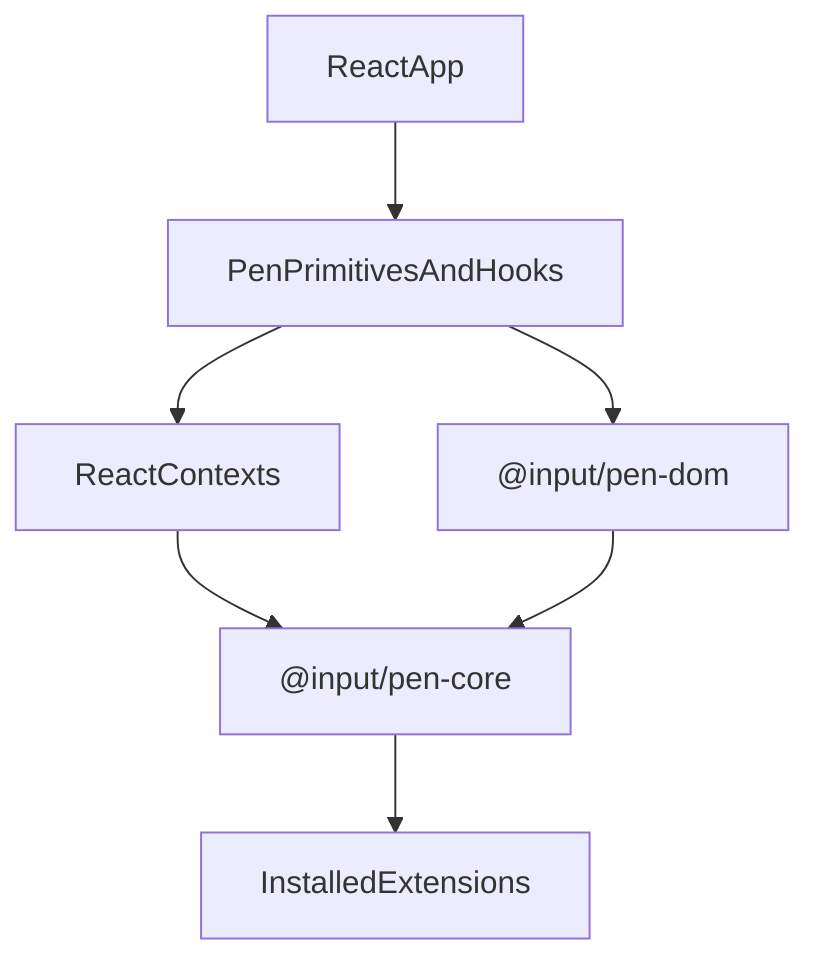

# @input/pen-react

## Purpose

`@input/pen-react` is the primary documented renderer surface for Pen. It binds the headless runtime to React components, hooks, contexts, and higher-level primitives for editor composition.

## Public Role

This package is where most adopters start when embedding Pen in a React application. It provides both a high-level convenience entrypoint and a lower-level compound-component surface, while keeping runtime authority in `@input/pen-core` and editing engine behavior in `@input/pen-dom`.

## Key Exports / Entrypoints

- Export map: `.`, `./ai`, `./ai-suggestions`, `./history`, `./multiplayer`, `./search`
- Convenience editor entrypoint: `PenEditor`
- Compound namespace: `Pen`
- Editor primitives such as `EditorRoot`, `EditorContent`, `EditorBlock`, `EditorCaretOverlay`, `CARET`, selection rects, and field-editor wrappers
- Toolbar, slash-menu, selection-toolbar, search, AI, AI suggestions, history, and multiplayer primitives
- Hooks such as `useEditor`, `useSelection`, `useDecorations`, `useBlockList`, `useSearch`, `useAI`, and related state hooks
- Advanced contexts and renderer options for custom composition
- Workspace scripts: `build`, `clean`, `dev`, `test`, `typecheck`

## Dependencies And Boundaries

- Runtime dependencies: `@input/pen-core`, `@input/pen-dom`, `@input/pen-schema`, `@input/pen-shortcuts`, `@input/pen-types`
- Peer dependencies: `@input/pen-ai`, `@input/pen-snapshots`, `@input/pen-interop`, `@input/pen-multiplayer`, `@input/pen-search` (all optional), plus `react` and `react-dom`
- Boundary: `@input/pen-react` binds the headless runtime to React without taking ownership of document truth.

## Runtime Model

React components and hooks sit above the editor and the shared DOM editing engine:

Important responsibilities:

- Mount editor roots and block rendering surfaces
- Subscribe React state to editor state through hooks and contexts
- Install the shared field-editor session and `bindEditorDocumentKeyDown()` for the active editor root. Escape (HOST7) and block-selection Enter (HOST8) are bubbling defaults; other document shortcuts stay in capture. Host `importers` / assets, when passed, are written with `internals.assignSlot("paste:importers" | "paste:assetProvider", …)`. This package does not install a default HTML importer; `defaultPreset()`'s `html-clipboard` extension does.
- Feature hooks (`useAI`, `useAISuggestions`, `useSearch`, `useSnapshots`, `useMultiplayer`, and siblings) read controllers from core facets (`aiControllerFacet`, `aiSuggestionsControllerFacet`, `searchControllerFacet`, `snapshotsControllerFacet`, `multiplayerControllerFacet`). When the matching optional peer / extension is absent, the hook returns empty state.
- Pointer activation walks to the block element (`data-pen-editor-block`), not the inline span. React keeps its own gesture path in `useEditorContentGestures` rather than calling `handleFieldEditorPointerActivate()`; the hit target is still the block. Clicks in the empty space above the first block or below the last block are handled by `handleClickOutsideBlocks` (focus an empty adjacent text block, or insert a paragraph). Vanilla and Vue share a different fallback in `handleFieldEditorPointerActivate` that places the caret at the last text block's end instead of inserting.
- Idle `InlineContent` and `TableCellContent` pass `{ editor }` into `fullReconcileDeltasToDOM` so `pen.urlPolicy` cannot be skipped by omitting a policy. `ImageRenderer` resolves `src` with `resolveEditorUrl(editor, src, "image")`. Denied URLs omit the attribute and set `data-pen-blocked-url`.
- `InlineAtomPortalLayer` mounts each host `inlineAtomRenderers` entry with `createElement`, so a renderer that calls hooks keeps a stable hook order when targets appear after the first paint. Calling the renderer as a plain function from the layer would register those hooks on the layer and trip React's hooks-order warning. Each renderer receives `interaction.remove` / `canRemove` (and the existing destructure/drag fields) from `@input/pen-dom`; hosts delete an atom by calling that callback rather than importing `./field-editor/inlineAtomInteraction` or walking `inlineDeltas()`. Double-click destructure is unchanged.
- `useSuggestionMenu` / `resolveSuggestionMenuTarget` are thin bindings over the same functions in `@input/pen-core`. Matching uses logical offsets (N6): an inline atom is one unit, a query that contains an atom is rejected, and `startOffset` after an atom is the offset after that unit, not a `textContent()` index. `removeInlineAtom` and `getInlineAtomAtOffset` are re-exported from `@input/pen-dom` on this package's root barrel.
- `mergeBlockDecorationAttributes` (`primitives/editor/block.tsx`) is the block-decoration counterpart to `applyElementAttributes` and carries the SEC2 skip for `/^on/i` and `style`, plus `dangerouslySetInnerHTML`, which only a React prop can turn into a sink. It maps `class` onto `className` and passes every other key through as a prop. Dropping `style` also protects RI1: the block host's `style` is the object carrying `unicode-bidi: isolate`, and a decoration's CSS string would replace it rather than merge with it.
- `useSlashMenu` returns `items` already partitioned by `display.group` through core's `orderSlashMenuItemsByGroup`, groups in first-appearance order and items in their incoming order, and the query path partitions after its relevance sort so the closest match stays at index 0. That ordering is a contract, not a presentation detail: `confirm(index)`, `select(index)`, and `selectedIndex` all index this array, and `SlashMenuList` auto mode renders it in order, opening a new group heading whenever the group changes between consecutive items rather than regrouping. Regrouping at render time is what made an option resolve a different block than the one it displayed, and it desynced `aria-activedescendant` from the visible selection against AX3. The ordering lives in `@input/pen-core` rather than here because it is DOM-free and a second renderer's menu needs the same invariant (API6).
- `useSlashMenu`'s `confirm` never leaves the trigger in the document. The trigger range is the one `getSlashTarget` matched — offset 0 through the caret, `/` and query together — and confirm deletes it in the same `undoGroup: true` apply that installs the chosen block. The branch turns on nothing but the length left outside that range, measured with `block.length()` so an inline atom inside the query counts as the one offset the `splice-text` will consume: zero means the trigger was the whole block, so the block is converted in place (a `set-props` on `type`, skipped when the block already has the chosen type) and the author gets the block they asked for where they asked for it; anything left over belongs to the author, so it keeps its block and the chosen type is inserted as a sibling. A confirm with no trigger at all — which is how a host-supplied `SlashMenu.Input` drives the hook, since the query it collects never reaches the document — reads the same way: an empty block converts, a block with text gets a sibling. Confirm resolves the trigger from the live document rather than from `state.target`, because `setQuery` moves `target.endOffset` to track that input. Leaving `/head` behind was AX3-visible, not only untidy: `getSlashTarget` matches any block whose text starts with `/`, so the listbox reopened whenever selection returned to the leftover paragraph. Table insertion still commits its starter columns in a second apply.
- `useEditor()` with no argument calls `createEditor({ schema: defaultSchema })`. It injects the default schema and still installs no preset — no undo, no shortcuts, no tools, no stream extension. Pass `preset: defaultPreset()` or an explicit `extensions` list when the host wants those.
- `EditorRoot` / `PenEditor` adopt `PEN_EDITOR_CHROME_STYLESHEET` by default (`chrome`, default `true`). Pass `chrome={false}` for the unstyled HOST6 path.

- `useEditor` owns only the editor it created: it destroys that editor on unmount, and returns an editor passed in as `useEditor(editor)` without ever destroying it. Ownership is what makes it the documented host entry point over a module-scope `createEditor`, which shares one instance across every mount and is never torn down. Because StrictMode runs effect setup, cleanup, then setup again for a single mount, the first cleanup destroys an owned editor while the component is still mounted; the hook detects the second setup and rebuilds, so a StrictMode host never renders against a destroyed editor.
- The `readonly` prop on `EditorRoot` / `PenEditor` is what declines typing and gestures. `pen.ariaReadOnly` is read only for `aria-readonly` and does not set `data-readonly`. The facet does not decline typing, `editor.apply`, or the wire. That split is an open owner decision.
- Boolean `data-*` attributes use the same valueless form as `@input/pen-dom` (`data-readonly=""`). ARIA booleans remain `"true"` / `"false"`.
- Host `cloneElement` onto a default list-item renderer lands `extraAttributes` and `data-*` on `[data-pen-list-item-layout]`, typed as the exported `ListItemHostAttributes` (HB8). `ListItemLayout` writes host attributes first, then the layout identity attributes, then each renderer's `libraryAttributes`, so a host cannot overwrite `data-block-type`, `data-indent`, `data-selected`, `data-pen-list-item-layout`, `data-counter`, or `data-checked`. The ordered-list marker text still comes from `useNumberedListItemValue` / `start`.
- Delegate shared DOM editing, selection transition, table-cell navigation, and shortcut routing behavior to `@input/pen-dom`
- Surface extension state through React-friendly primitives rather than reimplementing extension logic locally

## Integration Notes

- Path in workspace: `packages/rendering/react`
- Spec path mirrors workspace path: `packages/rendering/react.md`
- `PenEditor` is the simplest integration path for most apps
- The `Pen` namespace exists for lower-level composition when hosts need toolbar, slash-menu, AI, search, or multiplayer surfaces
- Optional subpath entrypoints let hosts import AI, AI suggestions, history, multiplayer, and search surfaces without pulling from the root barrel directly.
- `Pen.Editor.CaretOverlay` renders an optional local caret for collapsed active text selections, exposes `CARET` variants, and hides the native caret while the overlay is visible.
- Markdown ingest stays an optional peer on `@input/pen-interop` because not every React integration needs it. HTML paste ingest is not a React default; it comes from `defaultPreset()`'s `html-clipboard` extension (or a host `importers` prop). The renderer still exports `./ai-suggestions` as a UI subpath; the headless suggestion runtime is `@input/pen-ai/suggestions`.

## Current Maturity / Intended Usage

Workspace package at version `0.1.9`; intended usage is current-state but still evolving. This is still the main renderer the repo documents and validates most thoroughly.

## Non-goals

- Do not push core runtime, transport, or auth concerns into the React layer.
- Do not let React component state become a second document authority.
- Do not reimplement shared document keyboard, selection transition, table-cell, or DOM editing behavior locally just because React is the primary renderer.
