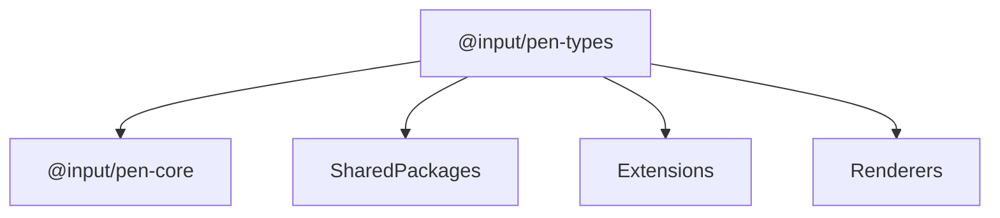

# @input/pen-types

## Purpose

`@input/pen-types` provides the shared contracts for Pen, plus a bounded, allowlisted sliver of runtime (API3). It defines editor, schema, extension, decoration, selection, tooling, history, undo, AI, and multiplayer interfaces, plus shared slot keys that other packages rely on.

## Public Role

This is the contract package for the monorepo. It is the place where packages agree on shared shapes, lifecycle hooks, slot names, and protocol-level helpers without importing heavier runtime packages like `@input/pen-core` or any renderer.

## Key Exports / Entrypoints

- Export map: `.`
- Root export of package-wide contracts via `./types/index`
- The API3 runtime allowlist: `generateId()` and its private formatter `formatUuidV4` (`scripts/types-runtime-allowlist.json`), kept here because `@input/pen-yjs` sits below core. Schema creation APIs, block-capability helpers, field-editor helpers, message interpolation, mutation-group helpers, `getOpOriginType()`, and tool-execution helpers live on `@input/pen-core`. `PenDocumentUnreadableError` lives on `@input/pen-yjs`.
- Shared `assignSlot` keys such as `FIELD_EDITOR_SLOT_KEY`, `SEARCH_CONTROLLER_SLOT`, `MULTIPLAYER_CONTROLLER_SLOT`, `SNAPSHOTS_CONTROLLER_SLOT`, and AI/undo-related keys. `editor.internals.assignSlot` is the write surface; it overrides the matching core facet.
- Editor events: `PenEventMap` — `commit` (`CommitEvent`, whose `summary.affectedBlockIds` is the touched-block list), `selectionChange`, `historyApplied`, `decorationsChange`, `diagnostic`, `crdt:corruption`, `crdt:recovered`
- Operation origin contracts such as `OpOriginType`, `StructuredOpOrigin` (including optional `intent`), `MutationGroupMetadata`, and helpers for resolving origin/group metadata
- The closed `DocumentOp` union and its ten payloads (`splice-text`, `format-text`, `insert-block`, `delete-block`, `move-block`, `set-props`, `set-meta`, `grid`, `app`, `stream-open`)
- `BlockSchema<Type, Props, Content>` defaults `Content` to `ContentType` (`"inline" | "none" | "table" | "subdocument" | BlockSchema[]`), not `"inline"`, so a nested-content or `content: "none"` block is a bare `BlockSchema` and belongs in `BlockSchema[]` / `SchemaRegistry.extend` without a cast (API10)
- `BlockSchema.serialize` (`toMarkdown` / `fromMarkdown` / `toHTML` / `fromHTML` / `toXML` / `fromXML`) plus `normalize` and `validateProps` are methods with `this: void`. They stay methods so `BlockSchema<"paragraph">` remains assignable to `BlockSchema` (function-property parameters are contravariant and would fail API10). `this: void` lets a host detach them (`const f = schema.serialize.toHTML`) without `@typescript-eslint/unbound-method`. `InlineSchema.serialize` and `AppSchema.serialize` were already function-typed properties. `.bind(undefined)` is legal; `.bind(schema.serialize)` is not, because `thisArg` must be `void`.
- `InlineSchema.serialize.toText?(props)` is the optional plain-text interchange hook for inline atoms (`kind: "node"`). Marks keep `toMarkdown` / `toHTML` `(text, props)` and ignore `toText` (IOP8)
- Change-summary contracts (`ChangeSummary`, `BlockTextChange`, `StructuralChange`, `TextSplice`)
- Anchor contracts (`EditorAnchors`, `Anchor`, `AnchorRange`, `AnchorTarget`) and adapter relative-position method types
- Document format stamp `PEN_DOCUMENT_FORMAT` (`3`)
- Shared AI operation contracts such as selection targets, scoped-range targets, requested-operation provenance, and low-level range helpers
- Review-surface vocabulary: `REVIEW_SURFACE_CLASSES`, `REVIEW_SURFACE_BLOCK_SUGGESTION_CLASSES`, `REVIEW_SURFACE_CUSTOM_PROPERTIES`, and `BlockSuggestion` / `BlockSuggestionAction` / `BlockSuggestionPreviousState`. The action union is the host-reachable set (`split-block` and `format-text` included, RS7). `@input/pen-ai` re-exports the class tokens and `BlockSuggestion`; the default sheet stays on `@input/pen-dom` (RS4).
- Wire stream contract `PenStreamRequest`: serializable context only (`docId`, `selection`, `blockId`). A live `Editor` is not a request field — `context.editor` was removed. Both AI transports take the editor at construction.
- Workspace scripts: `build`, `clean`, `dev`, `test`, `typecheck`

## Dependencies And Boundaries

- Runtime dependencies: No runtime workspace dependencies declared.
- Peer dependencies: No peer dependencies declared.
- Boundary: `@input/pen-types` should stay lightweight and avoid owning editor state, schema normalization, or renderer behavior.

## Runtime Model

`@input/pen-types` is not a runtime authority package. It is the contract layer that the rest of the monorepo composes around:

Important rules:

- `assignSlot` keys and interfaces defined here are cross-package contracts and should remain stable unless a real architectural change requires otherwise.
- Lightweight helpers are acceptable when they support contract authoring or schema declarations, but heavier behavior belongs elsewhere.
- Other packages should depend on this package to agree on shapes, not to inherit hidden runtime behavior.
- Structured mutation metadata belongs here because `@input/pen-core`, undo/history packages, AI extensions, and host workflows all need to agree on attribution and grouping semantics.
- If multiple packages need to agree on AI mutation target semantics, that target contract belongs here rather than being duplicated in package-local types.

## Structured Mutation Origins

`OpOrigin` accepts both legacy string origins and structured origins. Structured origins allow a host or extension to attach:

- `type`: the stable origin type, such as `user`, `ai`, or a host-defined string.
- `groupId`: a logical mutation group shared across one or more `editor.apply(...)` calls.
- `requestId`, `actorId`, and `source`: optional attribution fields for workflow and diagnostics.
- `intent`: optional command name stamped by dispatch on local applies (for example `pen.splitBlock`).

`getOpOriginType()`, `getApplyOptionsGroupId()`, and `createMutationGroupMetadata()` live on `@input/pen-core`. `@input/pen-undo` keeps a local `getOpOriginType` because it does not depend on core. Hosts should use structured origins for AI/workflow changes instead of encoding request metadata in ad hoc strings.

Command dispatch stamps `origin.intent` with the command's frozen name. Remote commits, undo/redo, and stream flushes carry no intent unless the original local origin already had one. Nothing infers intent from deltas.

## Document Operations

`DocumentOp` is a closed ten-member union. A new editing need is a command, a facet, or a schema change — not an eleventh variant.

- `splice-text` is the only text-content op. Offsets are in the target's pre-op logical domain. `insert` is a string, an inline atom (`{ nodeType, props }`), or an array of those. `marks` apply to inserted text only. Cell text uses optional `cell: { row, col }`.
- `format-text` is attribute-only and appears in summaries as `formatRanges`, never splices.
- `insert-block`, `delete-block`, and `move-block` are unchanged block-tree ops.
- `set-props` is per-key replace; `null` deletes the key. Setting `"type"` is a conversion: the validate phase revalidates props against the target schema.
- `set-meta` is a namespaced merge; `null` clears the namespace.
- `grid` folds the six table geometry kinds (`insert-row`, `delete-row`, `insert-column`, `delete-column`, `merge-cells`, `split-cell`).
- `app` folds create / update / delete app records.
- `stream-open` is the synthetic open-time op for stream veto. It is not a tool-applicable document op.

Split and merge are not ops. There is no `set-selection` op; command results and `authority.set` own selection writes.

## Change Summaries

A `ChangeSummary` answers what a commit touched: `commitId`, `blockText`, `structural`, and `affectedBlockIds`.

`blockText` is per-block splices (pre-commit offsets, `insertLength`) plus attribute-only `formatRanges`. The live `BlockTextChange` has no `cell` field.

`structural` is nine variants: `block-inserted`, `block-removed`, `block-moved`, `block-props-changed`, `block-split`, `blocks-merged`, `table-changed`, `apps-changed`, `metadata-changed`. There is no `block-converted` variant; a conversion is `block-props-changed` with `"type"` in `keys`. `metadata-changed` carries `namespaces`, not `keys`.

`block-split` and `blocks-merged` are the local content-move recipes (source, dest, cut/join offsets), stamped by the executor onto the transaction and copied onto the summary. Remote commits without those tags fall back to same-length delete/insert pairing.

`mapOffsetThroughSplices(splices, offset, assoc)` is a clamp helper for shifting a per-block result inside one summary. It ships from `@input/pen-core`, not this package — v4 DL12 moved it there under API3, which bounds this package's runtime to the recorded allowlist. There is no compose, no multi-summary form, and no cross-commit mapping API. A position that must survive more than one commit is an `editor.anchors` mint.

Summaries stay content-free: lengths, offsets, IDs, and keys only.

## Anchors

`Editor.anchors` (`EditorAnchors`) mints CRDT-relative positions when a location becomes interesting and resolves them when they are used.

- `create(target, assoc?)` returns an `Anchor` or `null` plus `anchor-target-missing`. Default assoc is `1`. `create` stamps `provenance: "local"`.
- `range({ anchor, focus })` mints `from` with assoc `-1` and `to` with assoc `1`.
- `resolve` / `resolveRange` return a live `AnchorTarget` (offset clamped into the logical length) or `null`. A fully deleted range resolves with `collapsed: true`.
- `serialize` / `deserialize` are the v1 JSON wire form. `deserialize` never throws; it stamps `provenance: "wire"`.
- `liveCount` is a monotonically increasing mint / deserialize / remint counter for the budget diagnostic. It does not decrement when an anchor is dropped.

The Yjs adapter implements `createRelativePosition` and `resolveRelativePosition` (`followUndoneDeletions` is adapter-internal; `editor.anchors.resolve` picks it from `provenance`). Local-provenance resolves with `followUndoneDeletions: true`; wire-provenance with `false`.

## Shared AI Target Contract

`@input/pen-types` is the canonical home for shared AI operation target shapes.

- `ModelOperationSelectionTarget` represents an explicit live selection with `anchor`, `focus`, `blockId`, and `sourceText`.
- `ModelOperationScopedRangeTarget` represents a selection-like synthetic scope such as `block`, `paragraph`, `heading`, or `document`.
- `ModelOperationScopedRangeTarget` must carry explicit `blockIds` and `contentFormat` because runtime behavior depends on those fields for streaming previews, text rendering, and final apply.
- `isScopedSelectionTarget()` stays here as a type-predicate guard. `resolveSelectionTargetBlockIds()`, `renderSelectionTargetText()`, and `renderSelectionTargetBlockText()` live on `@input/pen-core`.
- Packages may add package-local planning metadata around these targets, but they should not redefine the target semantics themselves.

## Integration Notes

- Path in workspace: `packages/types`
- Spec path mirrors workspace path: `packages/types.md`
- Reach for this package when defining extension interfaces, tool contracts, `assignSlot` keys, editor-facing types, or lightweight schema helpers
- Slot-key constants are the `assignSlot` write names that override mapped core facets. `defineExtension()` lives on `@input/pen-core`.
- Keep additions here broadly reusable; if something only matters once runtime state exists, it probably belongs in another package
- When AI, playground, and transport layers need to share mutation target behavior, prefer adding the shared shape and helper here once instead of letting each layer infer it differently

## Current Maturity / Intended Usage

Workspace package at version `0.2.0`; intended usage is current-state but still evolving. In practice it is one of the most sensitive packages in the repo because seemingly small contract changes can cascade through most of the workspace.

## Non-goals

- Do not move editor state, schema normalization, or framework behavior into `@input/pen-types`.
- Do not hide meaningful runtime logic behind what should remain a contract package.
- Do not let convenience exports turn this package into a dumping ground for unrelated helpers.
- Do not allow multiple competing definitions of the same protocol-level target contract across packages.
